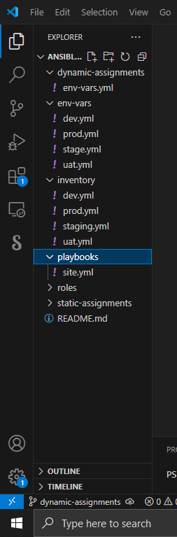

# Ansible Dynamic Assignments (Include) and Community Roles

## Tasks goal :  The goal of this task is to build on our existing ansible projects, and include dynamic roles to better understand the diffrence between a dynamic playbook and a static playbook.

### Step 1 :

  - In your ansible-config-mgt directory github repo , create another branch , name it `dynamic-assignments`
  - Inside the dynamic-assignments folder, create a new **YAML** file, name it `env-vars.yml`

    #### Your folder structure should like the output below

    Output: 

    #### Since the goal of this project is to create and maintain a dynamic ansible project, we will be making ue of variables to store the env details we will be needing, therefore ;

  - Create another directory and call it `env-vars`
  - inside it, create a new **YAML** file for each environment, that is `dev.yml prod.yml staging.yml uat.yml`,
  - inside the env-vars.yml fine, configure the required variables, use the code below

          ---
        vars_files:
          - "{{ playbook_dir }}/../../env-vars/dev.yml"
          - "{{ playbook_dir }}/../../env-vars/stage.yml"
          - "{{ playbook_dir }}/../../env-vars/prod.yml"
          - "{{ playbook_dir }}/../../env-vars/uat.yml"

    #### The code block above is an env yaml file that references other env variables files and thier location, so when the playbook searches for env variables, it goes directly through the folders specified

   - Now, inside your site.yml file , Update it to make use of the dynamic assignments, here is how it should look

           ---
          - name: Include dynamic variables
            hosts: all
            become: yes
            tasks:
              - include_vars: ../dynamic-assignments/env-vars.yml
                tags:
                  - always
          
          - import_playbook: ../static-assignments/db-servers.yml
          
          - import_playbook: ../static-assignments/uat-webservers.yml
          
          - import_playbook: ../static-assignments/loadbalancers.yml
            when: load_balancer_is_required

   ####  Based on the above playbook, we are simply referencing the dynamic-assignments/env-vars.yml file as well as importing other playbooks, this way, it is easier to manage and run multiple playbooks inside one general playbook

    

    
