# QUICK TASK

## Now setup the following tools using Helm

This section will be quite challenging for you because you will need to spend some time to research the charts, read their documentations and understand how to get an application running in your cluster by simply running a helm install command.

1. Artifactory
2. Hashicorp Vault
3. Prometheus
4. Grafana
5. Elasticsearch ELK using ECK

## 1. Artifactory

### The following steps were taking to install `JFrog Artifactory` in the EKS (Elastic Kubernetes Service) cluster using Helm:

1. Add the JFrog Helm chart repository to Helm

```bash
helm repo add jfrog https://charts.jfrog.io
helm repo update
```
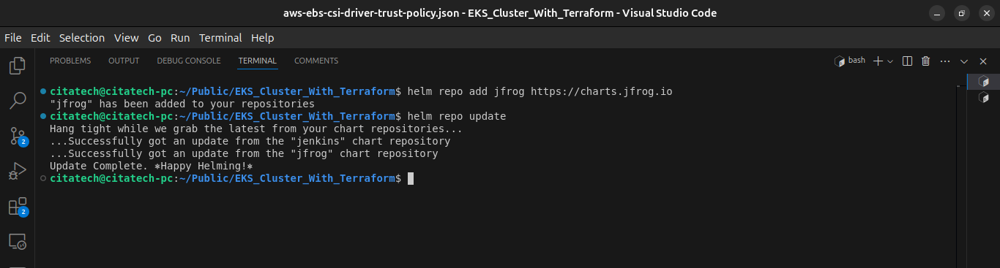

2. Create a Namespace for Artifactory.
   It’s a good practice to create a dedicated namespace for Artifactory

```bash
kubectl create namespace artifactory
```
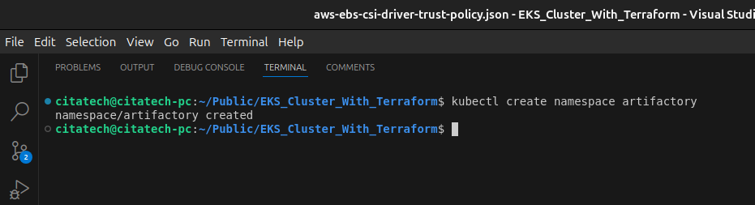

3. Install Artifactory Using Helm

```bash
helm install artifactory jfrog/artifactory \
  --namespace artifactory \
  --set artifactory.service.type=LoadBalancer \
  --set postgresql.enabled=true \
  --set artifactory.admin.password=admin
```
-	artifactory: Name of the release.
- jfrog/artifactory: Helm chart to install.
-	--namespace artifactory: Namespace where Artifactory will be installed.
-	--set artifactory.service.type=LoadBalancer: Exposes Artifactory using a LoadBalancer service.
-	--set postgresql.enabled=true: Enables PostgreSQL as the database for Artifactory.
-	--set artifactory.admin.password=<your-password>: Set the admin password.

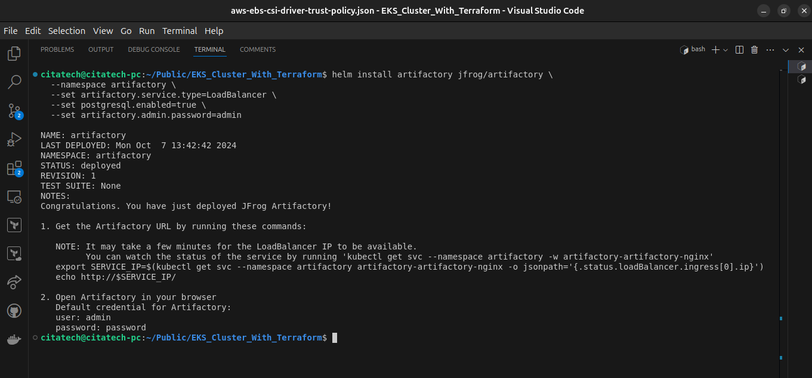

4. Check the status of the Helm release

```bash
helm status artifactory -n artifactory
```
Check status of nginx service

```bash
kubectl get svc --namespace artifactory -w artifactory-artifactory-nginx
```
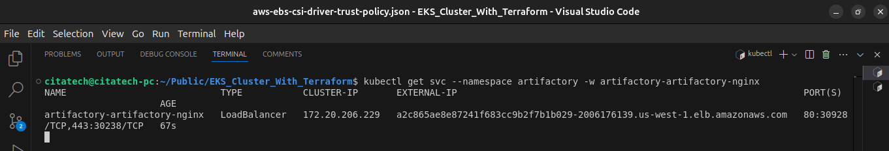

Check status of the service

```bash
kubectl get svc -n artifactory
```


5. Access the Artifactory via a browser by port forwarding

```bash
kubectl port-forward svc/artifactory  8082:8082 -n artifactory
```


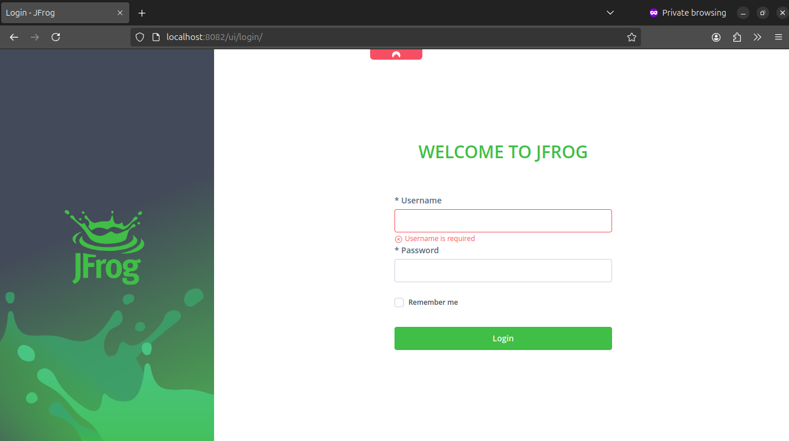


6. Get the LoadBalancer’s external IP to access Artifactory

Check the pods status

```bash
kubectl get pods -o wide -n artifactory
```
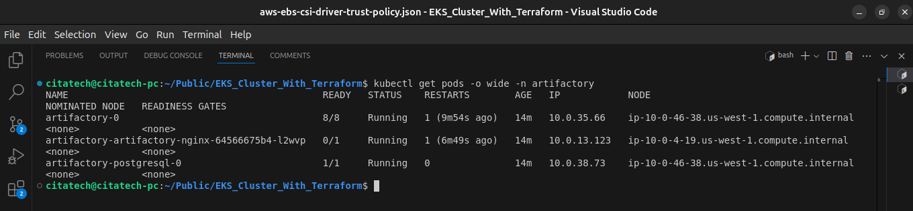

The Nginx pod is running but not ready

Let's run curl from the NGINX pod directly to the Artifactory pod IP 10.0.37.170 on port 8082

```bash
kubectl exec -it artifactory-artifactory-nginx-8455c7d85c-76g5f -n artifactory -- curl -v http://10.0.37.170:8082/router/api/v1/system/readiness
```
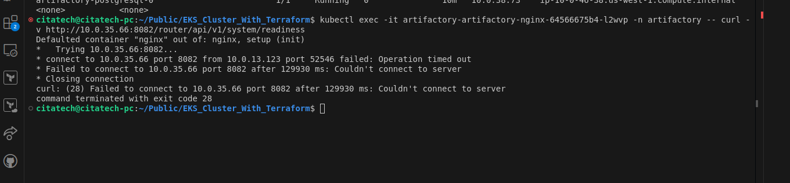

Since Nginx pod is experiencing connectivity issues, it could be network-related problem.
Both pods are running on different nodes in the cluster and the nodes are in different availability zones.

Allow inbound and outbound traffic on ports 8081 and 8082 for the security groups attached to the nodes in different AZs.

Now, check the Nginx pod again

```bash
kubectl get pods -o wide -n artifactory
```


The Nginx pod is now in a ready state.

Now, let's get the LoadBalancer’s external IP to access Artifactory from Nginx via the browser.
Look for the artifactory-artifactory service and note the EXTERNAL-IP

```bash
kubectl get svc --namespace artifactory -w artifactory-artifactory-nginx
```
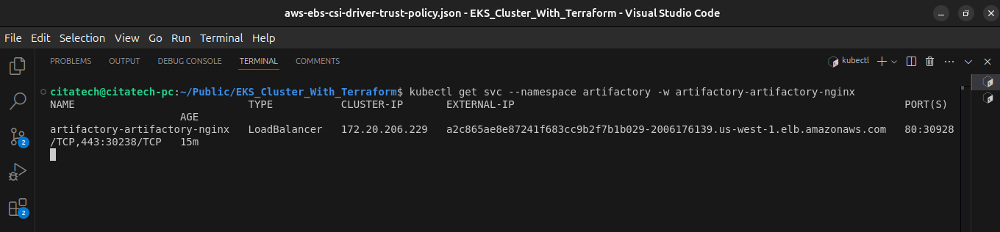


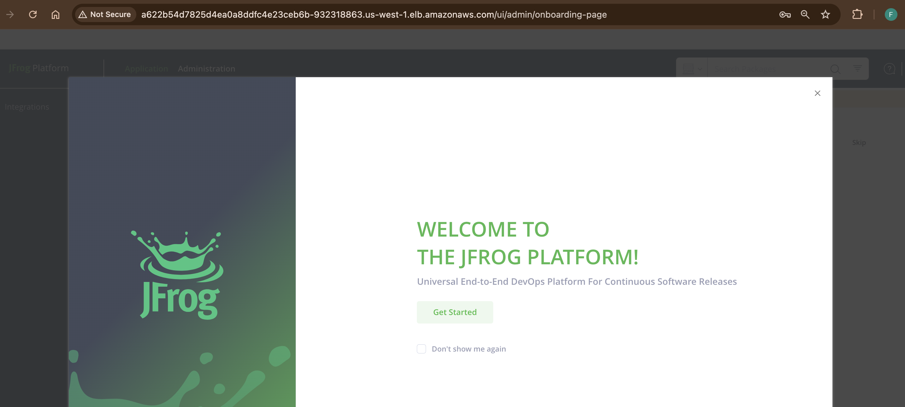

## 2. Hashicorp Vault

### Install HashiCorp Vault in EKS cluster using Helm

1.	Add HashiCorp Helm repository to get access to the Vault Helm chart

```bash
helm repo add hashicorp https://helm.releases.hashicorp.com
helm repo update
```
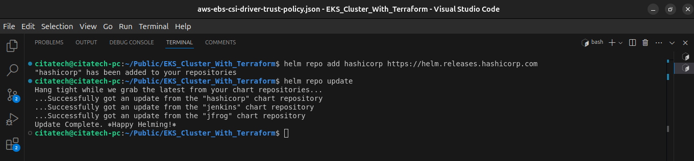

2.	Install Vault Using Helm

```bash
helm install vault hashicorp/vault --namespace vault --create-namespace
```
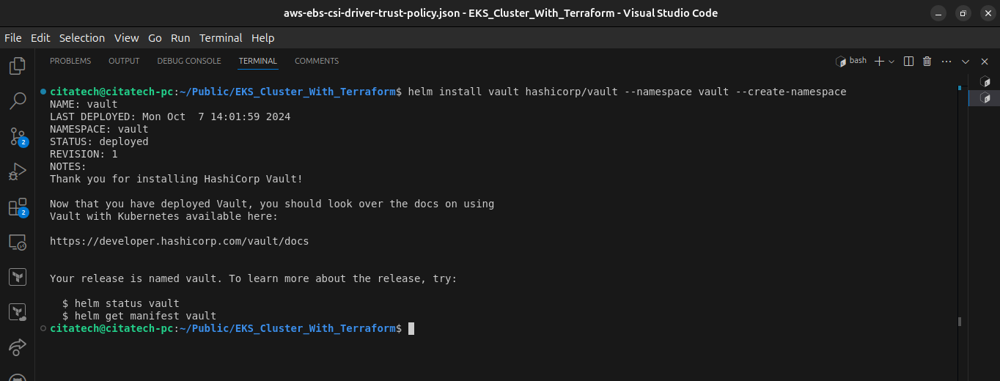

3. Check if Vault pods are running correctly in the EKS cluster.

```bash
kubectl get pods -n vault
```
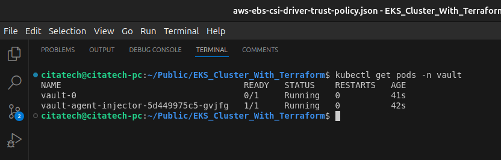

The vault-0 pod is in the “Running” state but not fully ready (0/1 READY).

Check its logs:

```bash
kubectl logs vault-0 -n vault
```
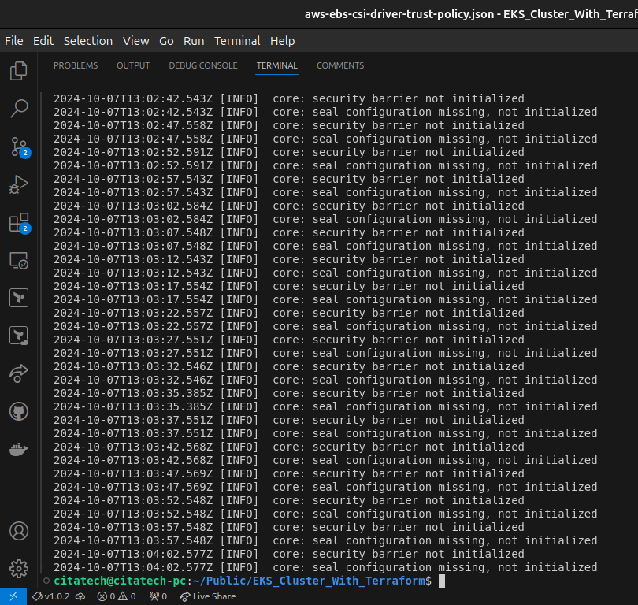

This shows that Vault has not completed its initialization or unseal process yet.

4. Initialize Vault

```bash
kubectl exec -it vault-0 -n vault -- vault operator init
```
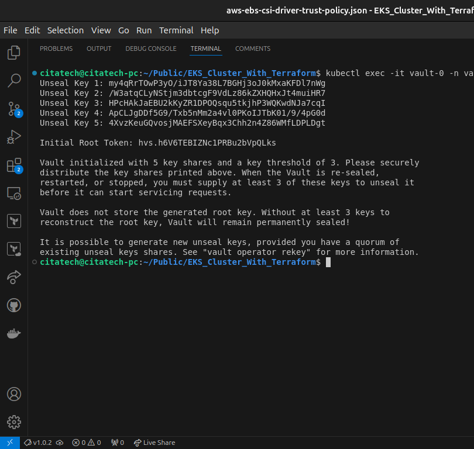

5. Unseal Vault

Once initialized, Vault needs to be unsealed using the unseal keys. We need to use 3 unseal keys to unseal the Vault.
Run this command three times with different unseal keys:

```bash
kubectl exec -it vault-0 -n vault -- vault operator unseal
```


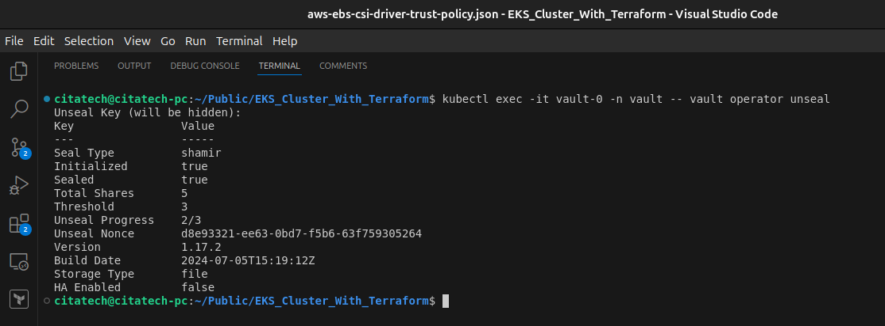


6. Check Vault Pod Status

Check the pod status again after unsealing

```bash
kubectl get pods -n vault
```
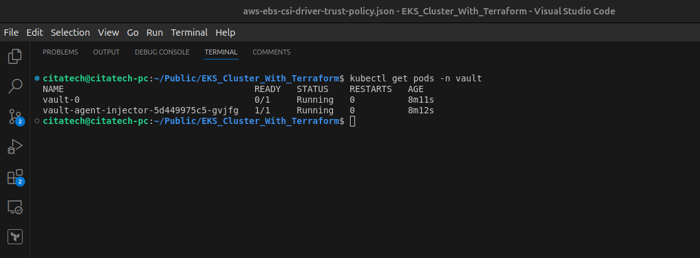

## 3. Prometheus

1. Add the Prometheus Helm repo

```bash
helm repo add prometheus-community https://prometheus-community.github.io/helm-charts
helm repo update
```
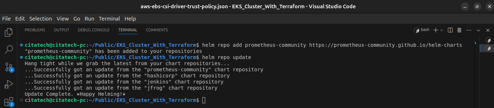

2. Create a namespace

```bash
kubectl create namespace monitoring
```
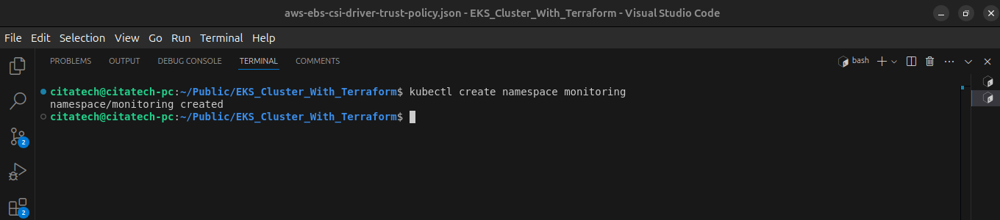

3. Install Prometheus

```bash
helm install prometheus prometheus-community/prometheus --namespace monitoring
```
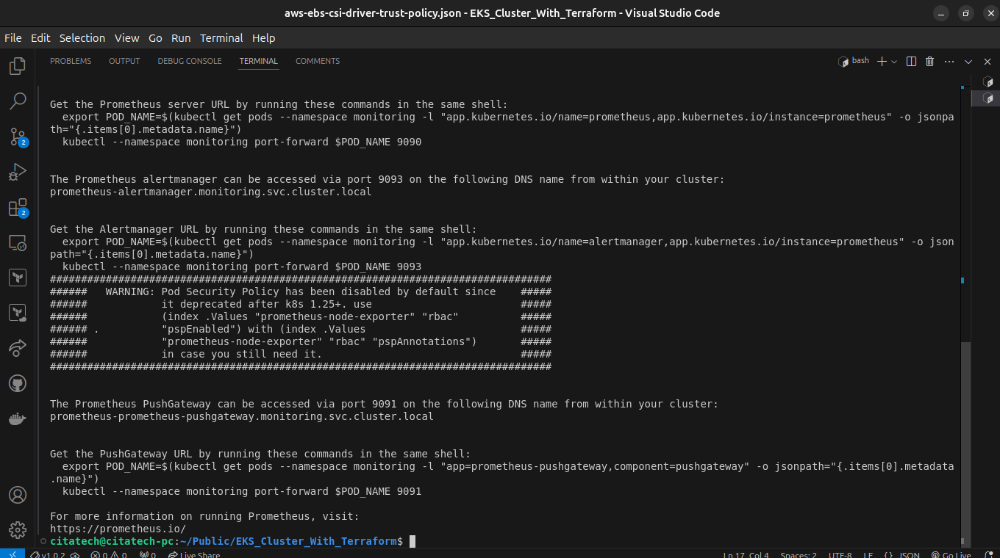

This command installs the Prometheus chart with the default configuration.

4. Verify that the Prometheus components are running by checking the pods in the monitoring namespace

```bash
kubectl get pods -n monitoring
```
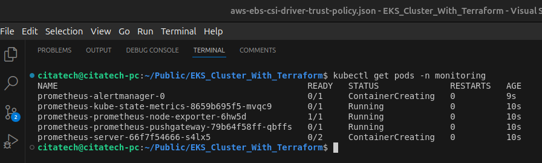

```bash
kubectl get svc -n monitoring
```


5.	Accessing Prometheus UI

Port-forward Prometheus to local machine to access the UI

```bash
kubectl port-forward -n monitoring svc/prometheus-server 9090:80
```


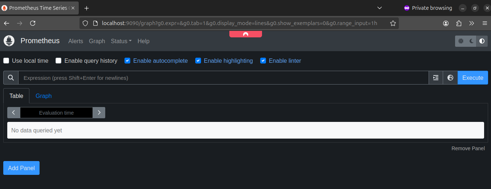

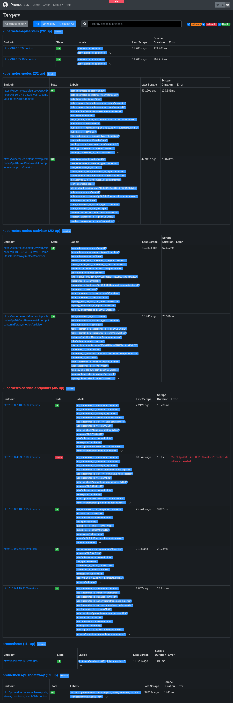


## 4. Grafana

1. Add the official Grafana Helm repository to Helm client

```bash
helm repo add grafana https://grafana.github.io/helm-charts
helm repo update
```
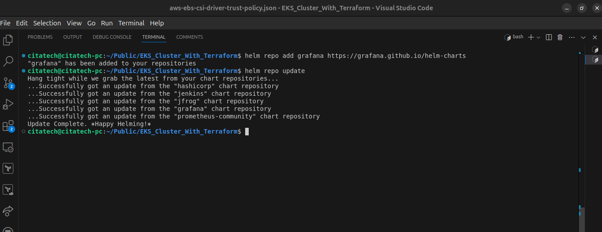

2. Install Grafana using Helm

```bash
helm install grafana grafana/grafana --namespace monitoring
```
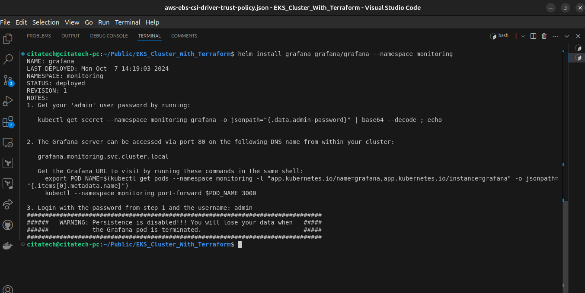

3. Get the Grafana admin password

```bash
kubectl get secret --namespace monitoring grafana -o jsonpath="{.data.admin-password}" | base64 --decode ; echo
```
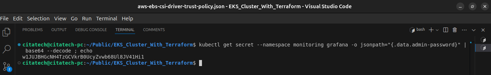

4. Access Grafana UI

Get the pod and service

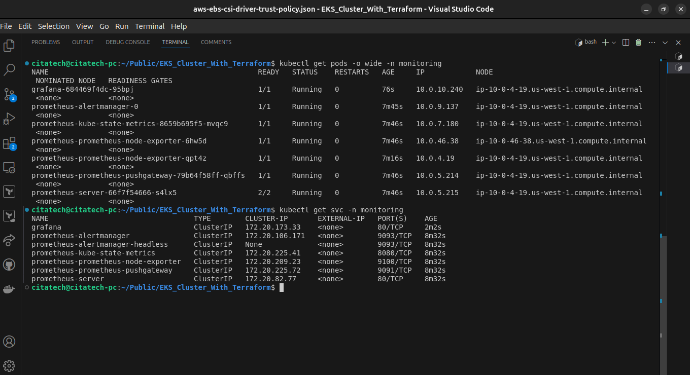

port-forward to the local machine

```bash
kubectl port-forward --namespace monitoring svc/grafana 3000:80
```
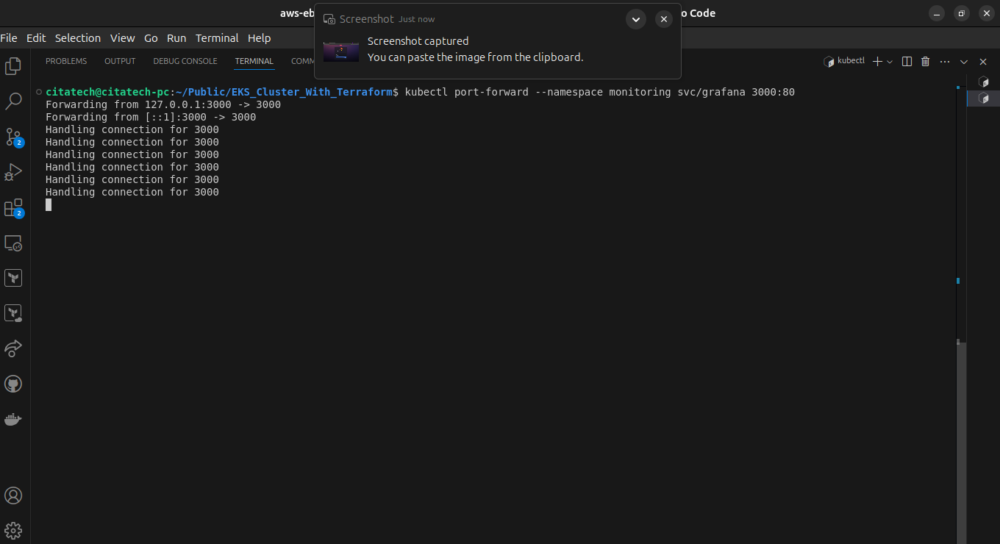

Access the UI with http://localhost:3000

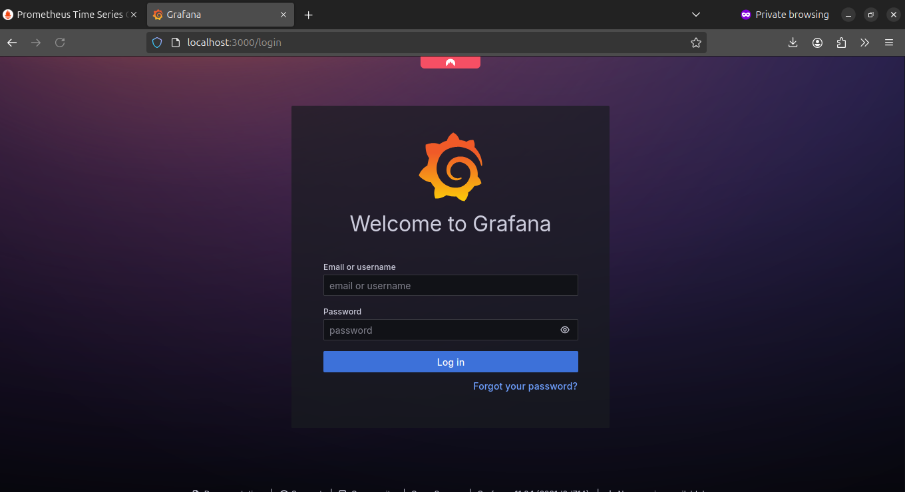

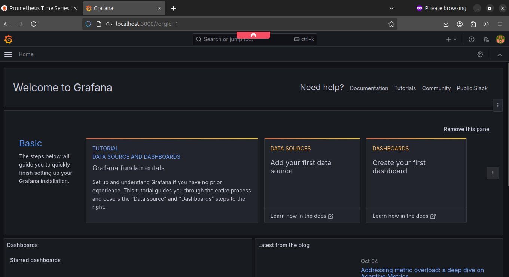


## 5. Elasticsearch ELK using ECK

### Step 1. Install ECK Operator

__ECK__ (Elastic Cloud on Kubernetes) is the official way to deploy and manage __Elasticsearch__ on Kubernetes. This will handle the deployment of Elasticsearch, Kibana, and other components.

1.	Add the Elastic Helm repository

```bash
helm repo add elastic https://helm.elastic.co
helm repo update
```
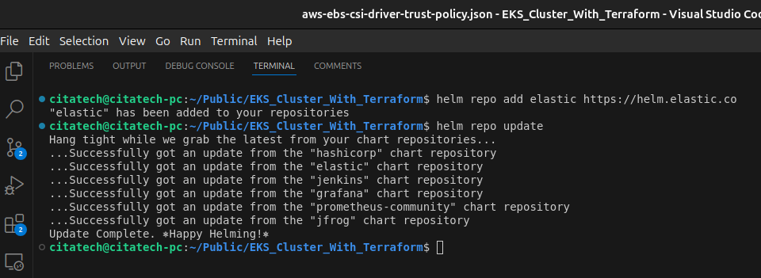

2. Install the ECK operator:

```bash
helm install elastic-operator elastic/eck-operator -n elastic-system --create-namespace
```
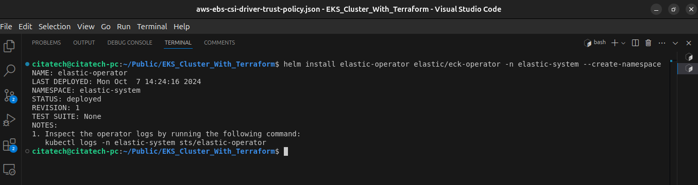


### Step 3: Install Elasticsearch, Kibana, and Logstash

Verify the ECK Operator Installation

```bash
kubectl get pods -o wide -n elastic-system
```
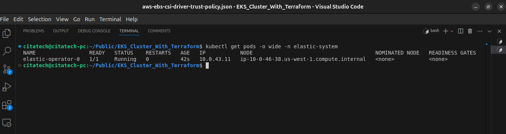

Inspect the operator logs

```bash
kubectl logs -n elastic-system sts/elastic-operator
```
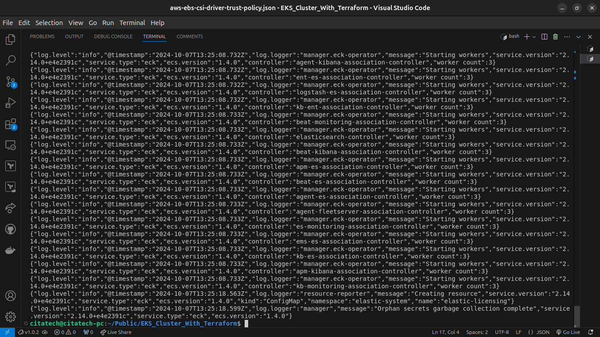

```bash
kubectl get svc -n elastic-system
```
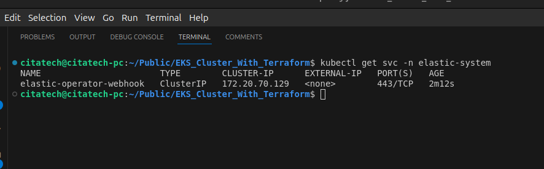

Now that ECK is installed, let's create custom resources (CRs) for the ELK stack (Elasticsearch, Kibana, Logstash).

1.	Create a YAML file for Elasticsearch - elasticsearch.yaml

```bash
apiVersion: elasticsearch.k8s.elastic.co/v1
kind: Elasticsearch
metadata:
  name: quickstart
  namespace: elastic
spec:
  version: 8.9.1
  nodeSets:
  - name: default
    count: 1
    config:
      node.store.allow_mmap: false
```

Apply Elasticsearch deployment:

```bash
kubectl apply -f elasticsearch.yaml
```


Verify the state of the Elasticsearch pods

```bash
kubectl get pods -n elastic
kubectl get svc -n elastic
```
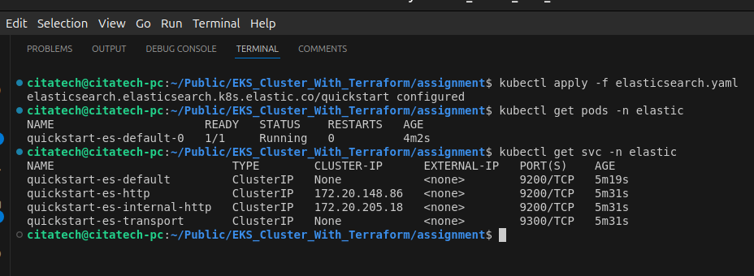

To access Elasticsearch locally on your machine, use port forwarding to access the Elasticsearch service:

```bash
kubectl port-forward svc/quickstart-es-http 9200 -n elastic
```

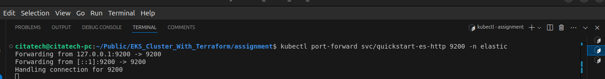

Retrieve the password

```bash
kubectl get secret quickstart-es-elastic-user -o=jsonpath='{.data.elastic}' -n elastic | base64 --decode
```
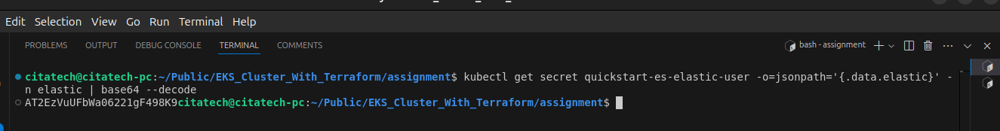

Test Locally

```bash
curl -u "elastic:Xr013M63N4SshU1B72x7fhkr" -k "https://localhost:9200"
```
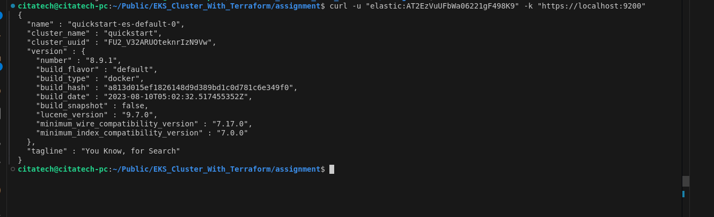

2. Create a YAML file for Kibana - kibana.yaml

This configuration links Kibana to your Elasticsearch deployment.

```bash
apiVersion: kibana.k8s.elastic.co/v1
kind: Kibana
metadata:
  name: kibana
  namespace: elastic
spec:
  version: 8.9.1
  count: 1
  elasticsearchRef:
    name: quickstart
```
Apply this configuration

```bash
kubectl apply -f kibana.yaml
```
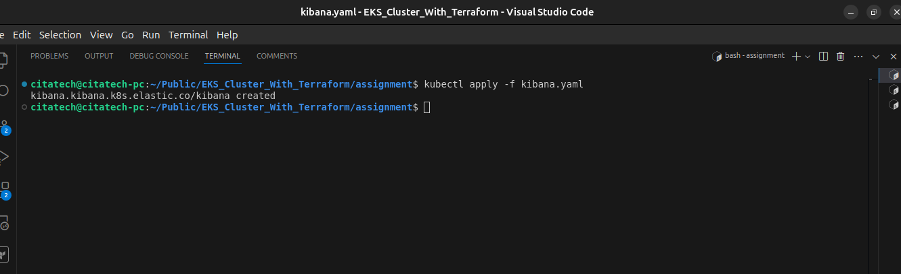

Check Kibana pod status

```bash
kubectl get pods -o wide -n elastic
```
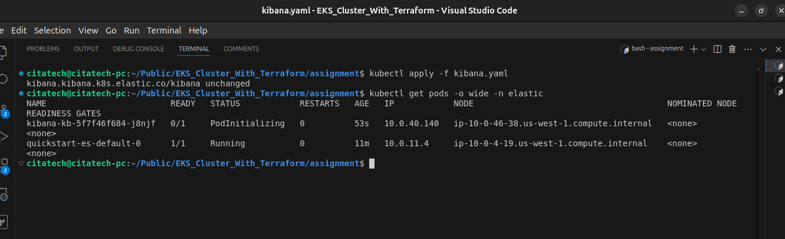

```bash
kubectl get svc -n elastic
```
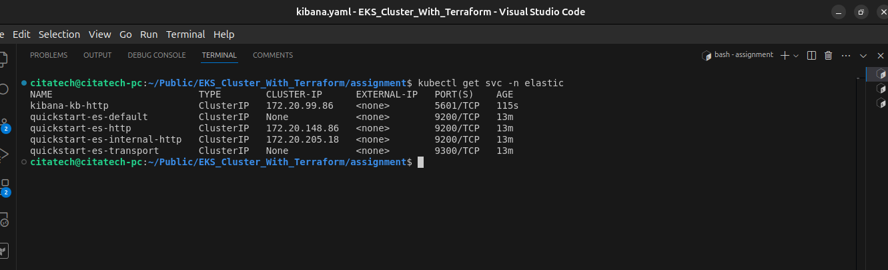

__Accessing Kibana__

Once Kibana is running, you can expose the service using port forwarding

```bash
kubectl port-forward svc/kibana-kb-http 5601 -n elastic
```


Access kibana at

```bash
http://localhost:5601
```

3. Deploy Logstash

Create a Logstash ConfigMap, we need to create a ConfigMap that contains the Logstash configuration (logstash.conf).

Create a ConfigMap file for logstash - logstash-config.yaml

```yaml
apiVersion: v1
kind: ConfigMap
metadata:
  name: logstash-config
  namespace: elastic
data:
  logstash.conf: |
    input {
      beats {
        port => 5044
      }
    }
    filter {
      grok {
        match => { "message" => "%{COMBINEDAPACHELOG}" }
      }
    }
    output {
      elasticsearch {
        hosts => ["https://quickstart-es-http.elastic:9200"]
        user => "elastic"
        password => "<your_elastic_password>"
        ssl => true
        cacert => '/usr/share/logstash/config/certs/ca.crt'
      }
      stdout { codec => rubydebug }
    }
```
Replace <your_elastic_password> with the password retrieved for the Elasticsearch elastic user.

Apply the logstash ConfigMap:

```bash
kubectl apply -f logstash-config.yaml
```
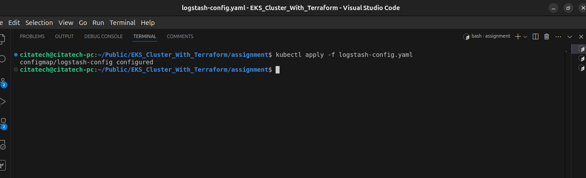

Create a YAML file for Logstash - logstash.yaml

```yaml
apiVersion: logstash.k8s.elastic.co/v1alpha1
kind: Logstash
metadata:
  name: logstash
  namespace: elastic
spec:
  version: 8.12.0
  count: 1
  config:
    log.level: info
  podTemplate:
    spec:
      containers:
        - name: logstash
          resources:
            limits:
              memory: 2Gi
              cpu: 1
```
Apply the configuration:

```bash
kubectl apply -f logstash.yaml
```
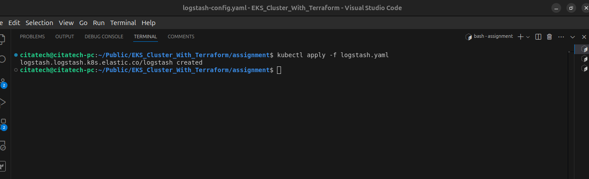

Check Logstash pod status

```bash
kubectl get pods -n elastic
```
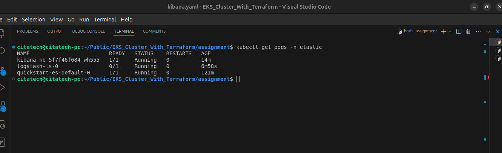

__Monitor and Manage__

Ensure all is correctly working, monitor the Elastic Stack resources using standard Kubernetes commands:

__Check all Elastic resources:__ The ELK stack (Elasticsearch, Kibana) is up and running on our Kubernetes cluster using the ECK operator

```bash
kubectl get elasticsearch,kibana,logstash -n elastic
```
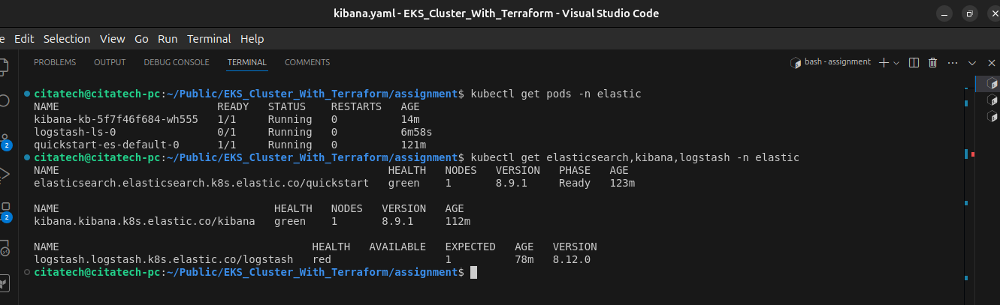

__The End__

In the next project,

1. You will write custom Helm charts
2. Configure Ingress for all the tools and applications running in the cluster
3. Integrate Secrets management using Hashicorp Vault
4. Integrate Logging with ELK
5. Inetegrate monitoring with Prometheus and Grafana.
