# DEPLOY JENKINS WITH HELM

Before we begin to develop our own helm charts, lets make use of publicly available charts to deploy all the tools that we need.

One of the amazing things about helm is the fact that you can deploy applications that are already packaged from a public helm repository directly with very minimal configuration. An example is __Jenkins__.

1. Visit [Artifact Hub](https://artifacthub.io/packages/search) to find packaged applications as Helm Charts
2. Search for Jenkins

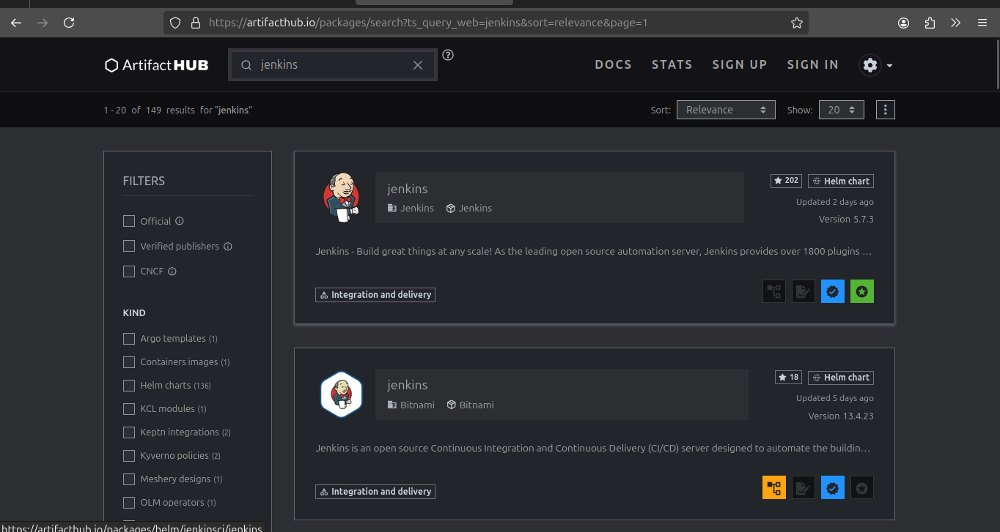

3. Add the repository to helm so that you can easily download and deploy

```bash
helm repo add jenkins https://charts.jenkins.io
```

4. Update helm repo

```bash
helm repo update
```
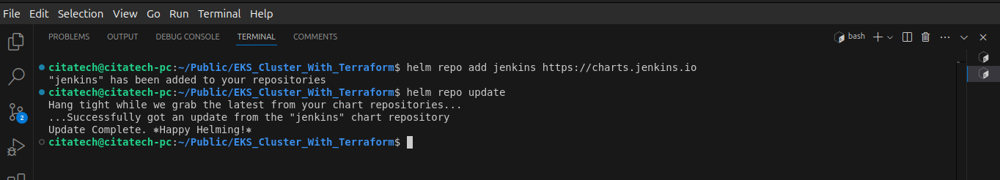

```bash
aws eks update-kubeconfig --name tooling-app-eks --region us-west-1 --kubeconfig ./kubeconfig
```

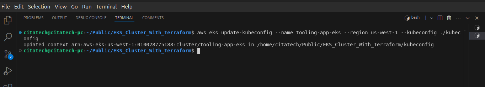

5. Install the chart

```bash
helm install [RELEASE_NAME] jenkins/jenkins --kubeconfig [kubeconfig file]

helm install jenkins-server jenkins/jenkins --kubeconfig kubeconfig
```
You should see an output like this

```
NAME: jenkins
LAST DEPLOYED: Sun Aug  1 12:38:53 2021
NAMESPACE: default
STATUS: deployed
REVISION: 1
NOTES:
1. Get your 'admin' user password by running:
  kubectl exec --namespace default -it svc/jenkins -c jenkins -- /bin/cat /run/secrets/chart-admin-password && echo
2. Get the Jenkins URL to visit by running these commands in the same shell:
  echo http://127.0.0.1:8080
  kubectl --namespace default port-forward svc/jenkins 8080:8080

3. Login with the password from step 1 and the username: admin
4. Configure security realm and authorization strategy
5. Use Jenkins Configuration as Code by specifying configScripts in your values.yaml file, see documentation: http:///configuration-as-code and examples: https://github.com/jenkinsci/configuration-as-code-plugin/tree/master/demos

For more information on running Jenkins on Kubernetes, visit:
https://cloud.google.com/solutions/jenkins-on-container-engine

For more information about Jenkins Configuration as Code, visit:
https://jenkins.io/projects/jcasc/

NOTE: Consider using a custom image with pre-installed plugins
```
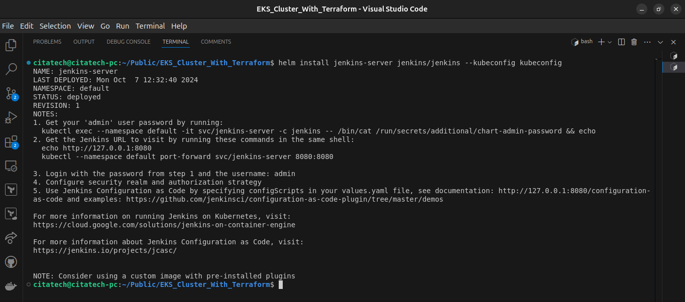

6. Check the __Helm deployment__

```bash
helm ls --kubeconfig kubeconfig
```
Output:
```
NAME    NAMESPACE       REVISION        UPDATED                                 STATUS          CHART           APP VERSION
jenkins default         1               2021-08-01 12:38:53.429471 +0100 BST    deployed        jenkins-3.5.9   2.289.3
```
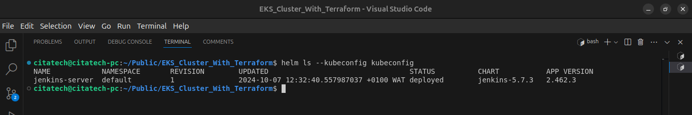

7. Check the pods

```bash
kubectl get pods --kubeconfig kubeconfig
```
Output:
```
NAME        READY   STATUS    RESTARTS   AGE
jenkins-0   2/2     Running   0          6m14s
```
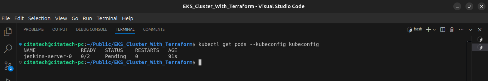

```bash
kubectl describe pods -- kubeconfig
```

```bash
kubectl describe pvc -- kubeconfig
```
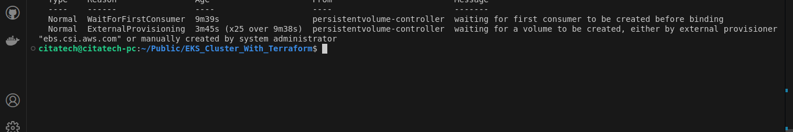

The Event section shows that Kubernetes is waiting for the external provisioner to create the volume, but it’s not happening. This typically means that there might be an issue with the EBS CSI (Container Storage Interface) driver or the AWS EBS service itself.

__Troubleshooting__

Get the cluster's OIDC provider URL

```bash
 aws eks describe-cluster --name tooling-app-eks --region us-west-1 --query "cluster.identity.oidc.issuer" --output text
 ```
 
 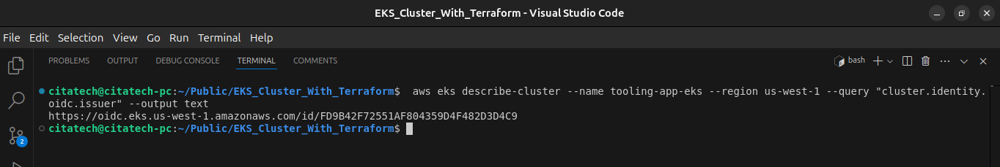

Create IAM role, granting the __AssumeRoleWithWebIdentity__ action.

Copy the following contents to a file that's named `aws-ebs-csi-driver-trust-policy.json` Replace 111122223333 with your account ID. Replace EXAMPLED539D4633E53DE1B71EXAMPLE and region-code with the values returned in the oidc url.

```json
{
  "Version": "2012-10-17",
  "Statement": [
    {
      "Effect": "Allow",
      "Principal": {
        "Federated": "arn:aws:iam::111122223333:oidc-provider/oidc.eks.region-code.amazonaws.com/id/EXAMPLED539D4633E53DE1B71EXAMPLE"
      },
      "Action": "sts:AssumeRoleWithWebIdentity",
      "Condition": {
        "StringEquals": {
          "oidc.eks.region-code.amazonaws.com/id/EXAMPLED539D4633E53DE1B71EXAMPLE:aud": "sts.amazonaws.com",
          "oidc.eks.region-code.amazonaws.com/id/EXAMPLED539D4633E53DE1B71EXAMPLE:sub": "system:serviceaccount:kube-system:ebs-csi-controller-sa"
        }
      }
    }
  ]
}
```
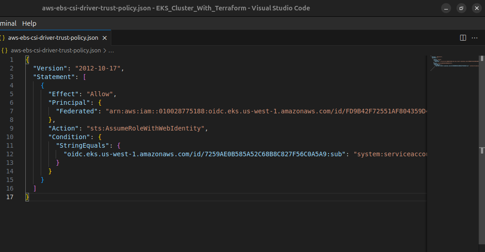

Create the role, name it __AmazonEKS_EBS_CSI_DriverRole__

```bash
aws iam create-role \
--role-name AmazonEKS_EBS_CSI_DriverRole \
--assume-role-policy-document file://"aws-ebs-csi-driver-trust-policy.json"
```
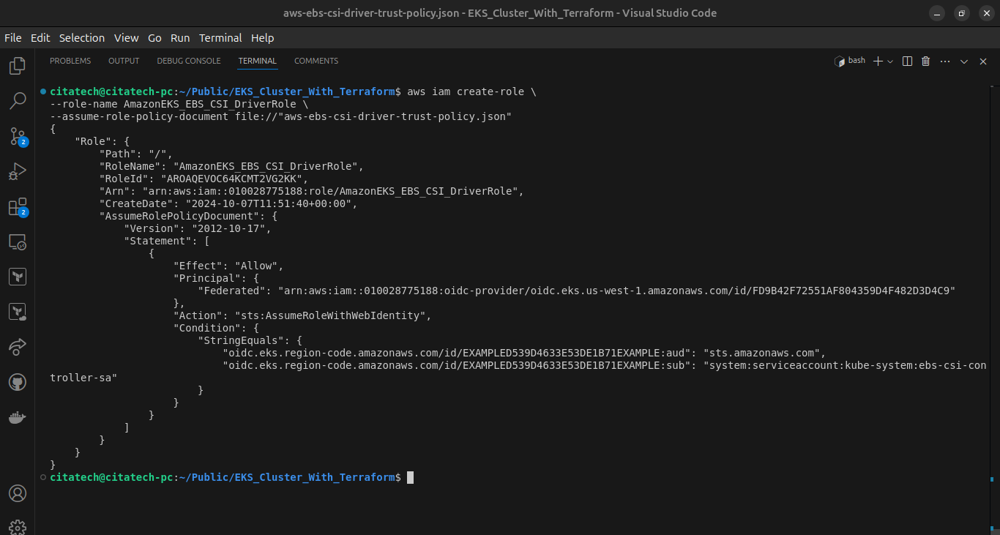


Attach a policy - __AmazonEBSCSIDriverPolicy__

```bash
aws iam attach-role-policy \
      --policy-arn arn:aws:iam::aws:policy/service-role/AmazonEBSCSIDriverPolicy \
      --role-name AmazonEKS_EBS_CSI_DriverRole
```
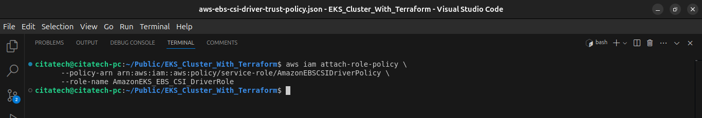

Install Amazon EBS CSI driver through the Amazon EKS add-on to improve security and reduce amount of work. (Using the `eksctl`)

```bash
eksctl create addon --name aws-ebs-csi-driver --cluster tooling-app-eks --region us-west-1
```


```bash
eksctl utils migrate-to-pod-identity --cluster tooling-app-eks --region us-west-1 --approve
```
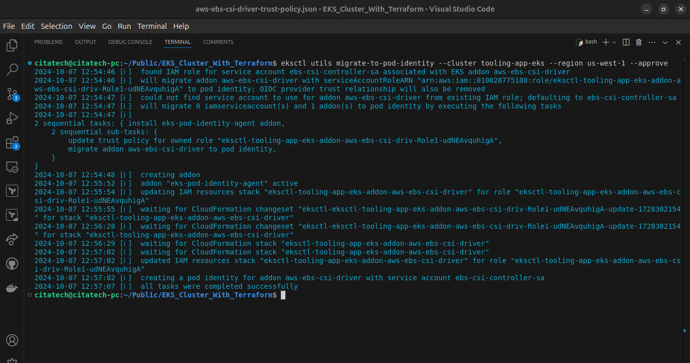

__Check the pods__

```bash
kubectl get pods --kubeconfig kubeconfig
```
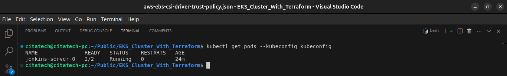

8. Describe the running pod (review the output and try to understand what you see)

```bash
kubectl describe pod jenkins-server-0 --kubeconfig kubeconfig
```
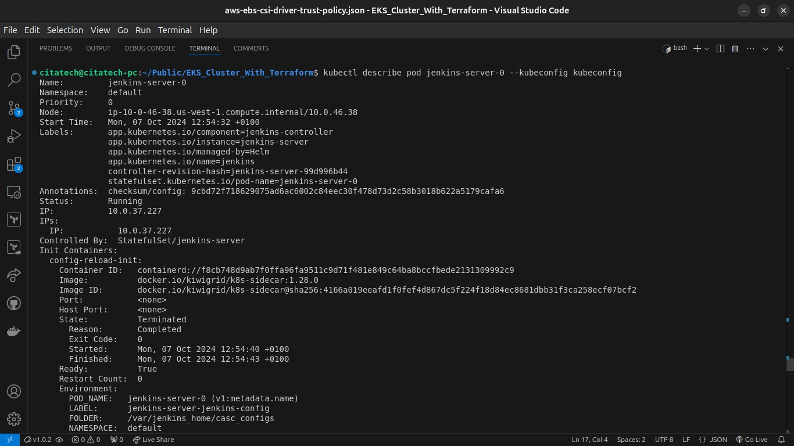

9. Check the logs of the running pod

```bash
kubectl logs jenkins-server-0 --kubeconfig kubeconfig
```
You will notice an output with an error.

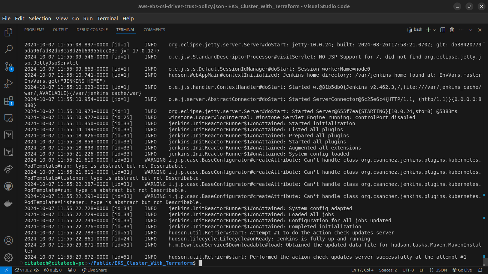

This is because the pod has a `Sidecar container` alongside with the Jenkins container. As you can see fromt the error output, there is a list of containers inside the pod `[jenkins config-reload] i.e jenkins and config-reload containers`. The job of the config-reload is mainly to help Jenkins to reload its configuration without recreating the pod.

Therefore we need to let `kubectl` know, which pod we are interested to see its log. Hence, the command will be updated like:

```bash
kubectl logs jenkins-server-0 -c jenkins --kubeconfig kubeconfig
```

Now lets avoid calling the [kubeconfig file] everytime. Kubectl expects to find the default kubeconfig file in the location `~/.kube/config`. But what if you already have another cluster using that same file? It doesn’t make sense to overwrite it. What you will do is to merge all the __kubeconfig__ files together using a __kubectl plugin__ called [konfig](https://github.com/corneliusweig/konfig) and select whichever one you need to be active.

1. Install a package manager for kubectl called [krew](https://krew.sigs.k8s.io/docs/user-guide/setup/install/) so that it will enable you to install plugins to extend the functionality of kubectl. Read more about it [Here](https://github.com/kubernetes-sigs/krew).

- Run this command to download and install krew:

```bash
(
  set -x; cd "$(mktemp -d)" &&
  OS="$(uname | tr '[:upper:]' '[:lower:]')" &&
  ARCH="$(uname -m | sed -e 's/x86_64/amd64/' -e 's/\(arm\)\(64\)\?.*/\1\2/' -e 's/aarch64$/arm64/')" &&
  KREW="krew-${OS}_${ARCH}" &&
  curl -fsSLO "https://github.com/kubernetes-sigs/krew/releases/latest/download/${KREW}.tar.gz" &&
  tar zxvf "${KREW}.tar.gz" &&
  ./"${KREW}" install krew
)
```
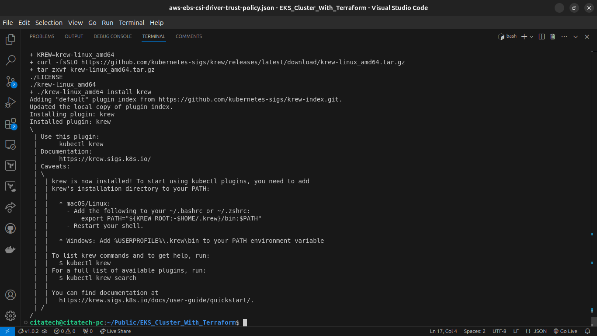

- Add the `$HOME/.krew/bin` directory to your PATH environment variable. To do this, update your `.bashrc` or `.zshrc` file and append the following line and restart your shell.

```bash
export PATH="${KREW_ROOT:-$HOME/.krew}/bin:$PATH"
```

- Run `kubectl krew` to check the installation.

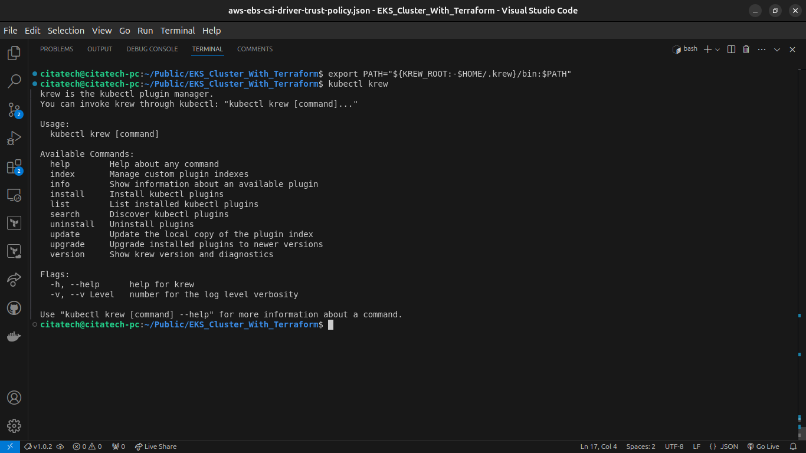

2. Install the [konfig plugin](https://github.com/corneliusweig/konfig)

```bash
kubectl krew install konfig
```
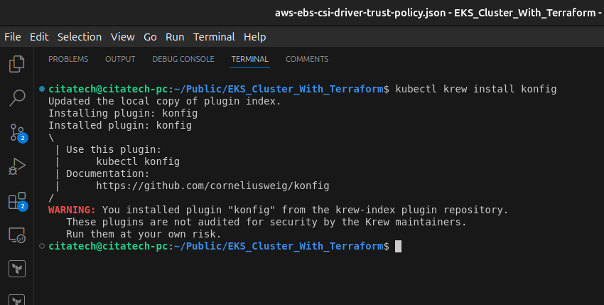

3. Import the kubeconfig into the default kubeconfig file. Ensure to accept the prompt to overide.

```bash
kubectl konfig import --save kubeconfig
```

4. Show all the contexts – Meaning all the clusters configured in your kubeconfig. If you have more than 1 Kubernetes clusters configured, you will see them all in the output.

```bash
kubectl config get-contexts
```
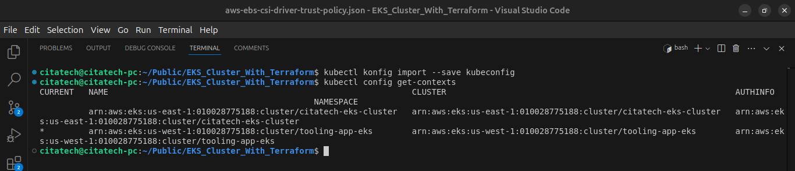

5. Set the current context to use for all kubectl and helm commands

```bash
kubectl config use-context [name of EKS cluster]

kubectl config use-context arn:aws:eks:us-west-1:992382613070:cluster/tooling-app-eks
```
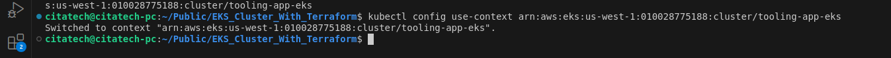

6. Test that it is working without specifying the `--kubeconfig` flag

```bash
kubectl get po
```
Output:
```
NAME        READY   STATUS    RESTARTS   AGE
jenkins-0   2/2     Running   0          84m
```
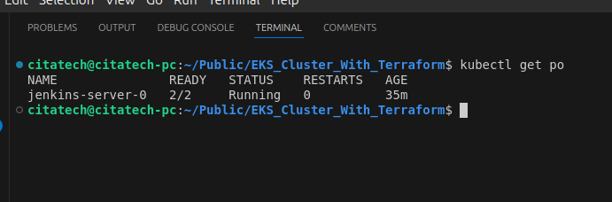

7. Display the current context. This will let you know the context in which you are using to interact with Kubernetes.

```bash
kubectl config current-context
```
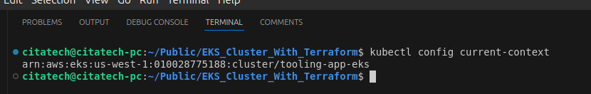

Now that we can use kubectl without the --kubeconfig flag, Lets get access to the Jenkins UI. _(In later projects we will further configure Jenkins. For now, it is to set up all the tools we need)_

1. There are some commands that was provided on the screen when Jenkins was installed with Helm. See number 5 above. Get the password to the `admin user`

```bash
kubectl exec --namespace default -it svc/jenkins-server -c jenkins -- /bin/cat /run/secrets/additional/chart-admin-password && echo
```
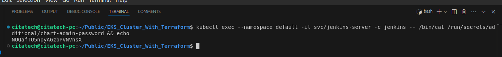

2. Use port forwarding to access Jenkins from the UI

```bash
kubectl --namespace default port-forward svc/jenkins-server 8080:8080
```
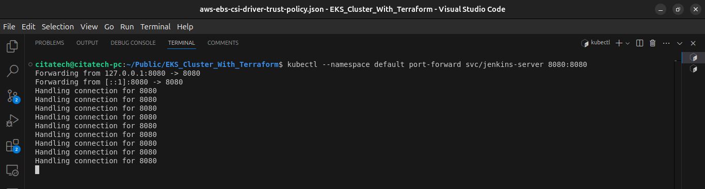


3. Go to the browser __localhost:8080__ and authenticate with the username and password from number 1 above

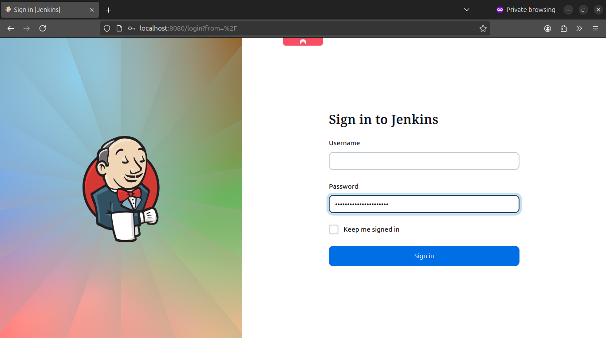

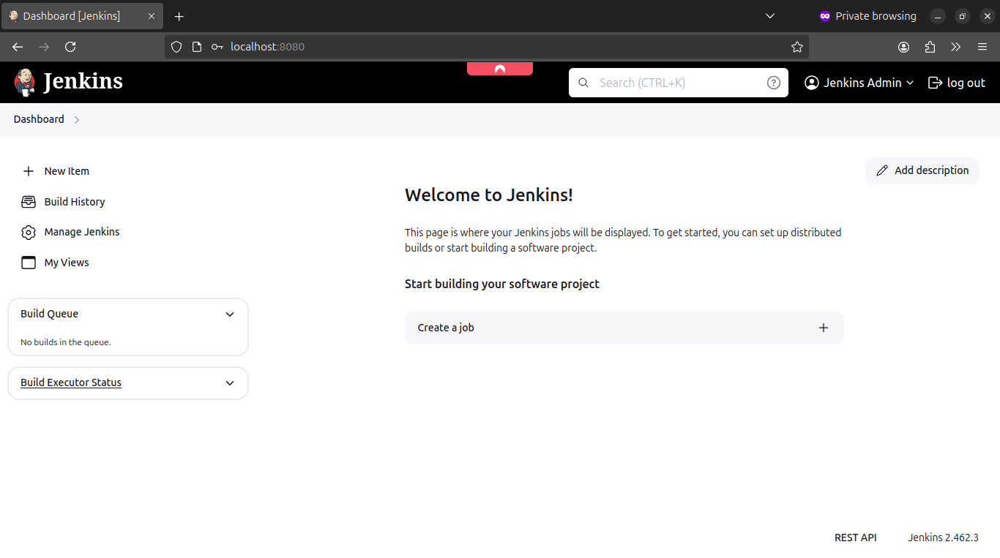
