# Implementing Secure HTTPS with Cert-Manager and Let's Encrypt 101

## DevOps/Cloud Engineering Project: Secure HTTPS for Artifactory

In this project, we enhance the security of our Artifactory deployment by implementing HTTPS using [Cert-Manager](https://cert-manager.io) to automatically request and manage TLS certificates from Let's Encrypt. This provides a trusted HTTPS URL for our application.


## Prerequisites

- EKS Kubernetes cluster with Nginx Ingress Controller installed
- Helm 3.x installed
- Kubectl configured to interact with your cluster
- Domain name configured with DNS pointing to your Ingress Controller's load balancer
- Nginx Ingress Controller installed (from the previous project)

## Implementation Steps

### Step 1: Install Cert-Manager

1. Add the Jetstack Helm repository:
   ```
   helm repo add jetstack https://charts.jetstack.io
   ```

2. Update your local Helm chart repository cache:
   ```
   helm repo update
   ```
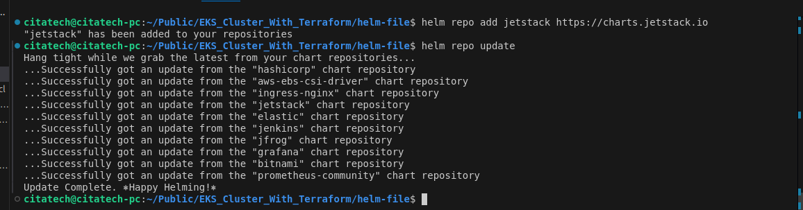

3. Set up an EKS IAM role for a service account for cert-manager:

   - Follow the guide at: [EKS IAM Role for Service Accounts](https://cert-manager.io/docs/configuration/acme/dns01/route53/#eks-iam-role-for-service-accounts-irsa)

Steps for `3` above include :  

 A. Retrieve IAM OIDC Provider for Your EKS Cluster
```   
aws eks describe-cluster --name <EKS_CLUSTER_NAME> --query "cluster.identity.oidc.issuer" --output text
```
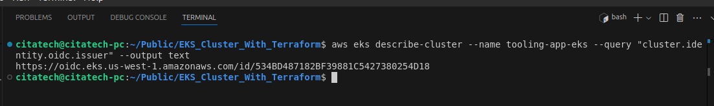

 B. Create the IAM policy required by cert-manager for managing Route53 records. Save the following policy document in a file called cert-manager-policy.json
 ```json
   {
    "Version": "2012-10-17",
    "Statement": [
        {
            "Effect": "Allow",
            "Action": [
                "route53:GetChange",
                "route53:ChangeResourceRecordSets",
                "route53:ListHostedZones",
                "route53:ListResourceRecordSets"
            ],
               "Resource": "*"
         }
      ]
   }
```
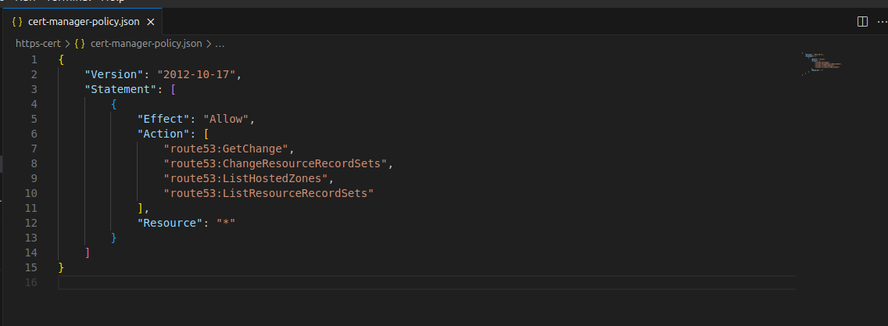

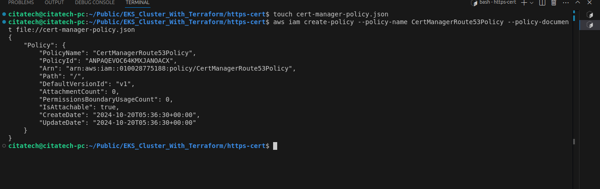

C. Create an IAM Role for the cert-manager ServiceAccount
  - In the IAM console, go to Roles and click on Create role.

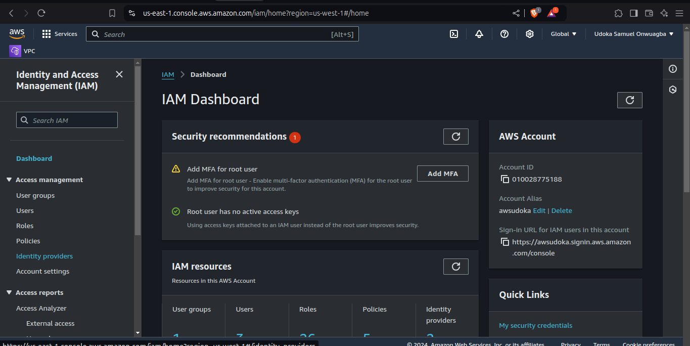

  - Select trust entity and select `Web Identity` and below it, select the oidc of your eks cluster
  - Set the audience and click next.
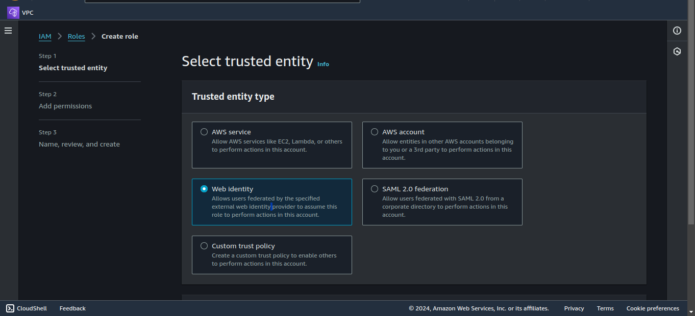
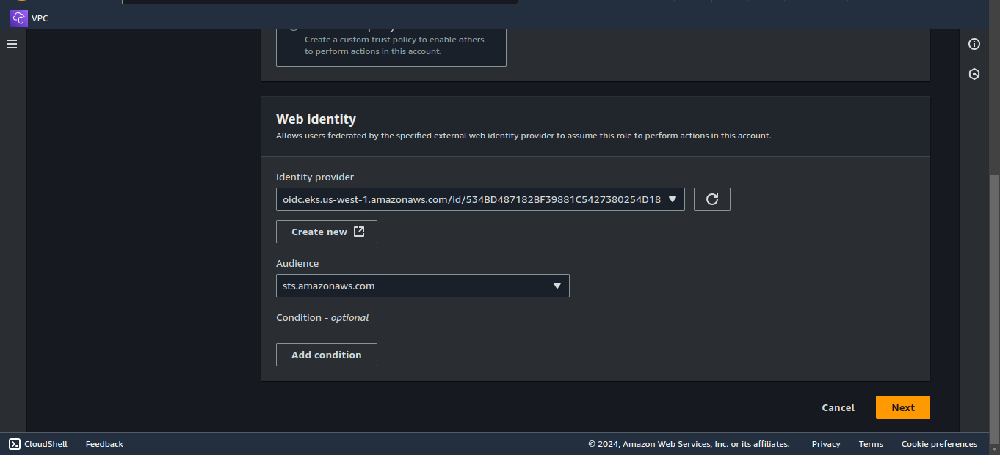

  - Search for the policy you created in Step 2 (CertManagerRoute53Policy) and select it.

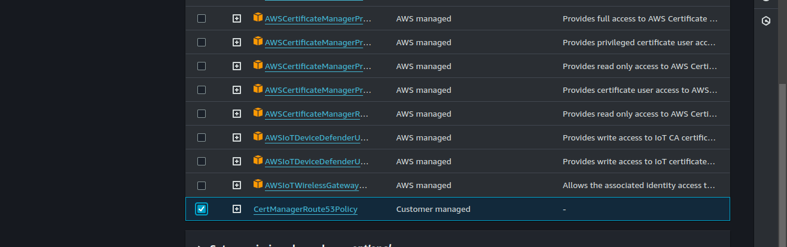
  - Create role.

  - Now edit the trust policy for your newly created role and add the following below 
  ```json
   {
    "Version": "2012-10-17",
    "Statement": [
        {
            "Effect": "Allow",
            "Action": "sts:AssumeRoleWithWebIdentity",
            "Principal": {
                "Federated": "arn:aws:iam::<aws-account-id>:oidc-provider/oidc.eks.<aws-region>.amazonaws.com/id/<eks-hash>"
            },
            "Condition": {
                "StringEquals": {
                    "oidc.eks.<aws-region>.amazonaws.com/id/<eks-hash>:sub": "system:serviceaccount:cert-manager:cert-manager"
                     }
                  }
            }
         ]
      }
   ```
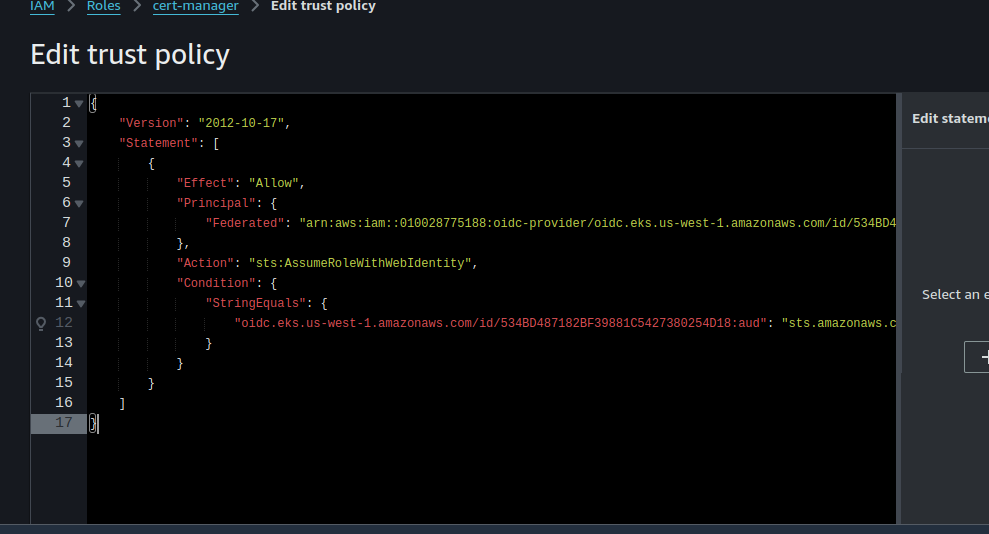

D. Create namespace `cert-manager`
   ```
   kubectl create namespace cert-manager
   ```

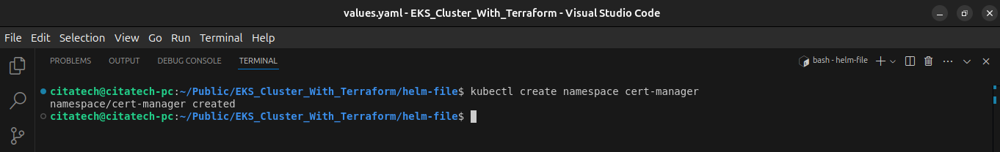

E. Annotate the cert-manager ServiceAccount in Kubernetes
   ```bash
   # create a new file `cert-manager-sa.yaml`
   touch cert-manager-sa.yaml
   ```
   ```yaml
   # include the code block below 

   apiVersion: v1
   automountServiceAccountToken: true
   kind: ServiceAccount
   metadata:
   annotations:
      eks.amazonaws.com/role-arn: arn:aws:iam::312973238800:role/cert_manager_role
   name: cert-manager
   namespace: cert-manager
   ```
Replace <aws-account-id> with your actual AWS account ID.

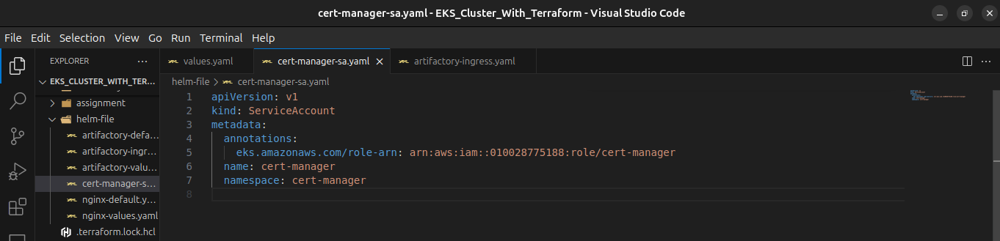

F. Apply the manifest:
   ```
   kubectl apply -f cert-manager-sa.yaml
   ```
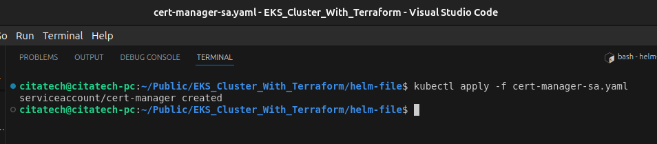

G. Configure RBAC for Cert-Manager ServiceAccount
   - Create a new file `cert-manager-rbac.yaml`
      ```
      touch cert-manager-rbac.yaml
      ```
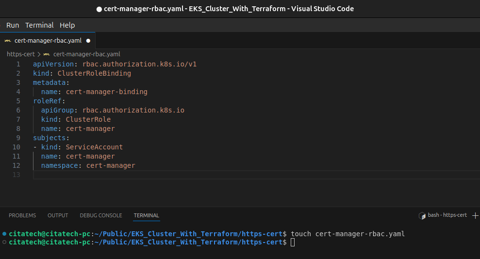

   - Apply the configuration
      ```
      kubectl apply -f cert-manager-rbac.yaml
      ```
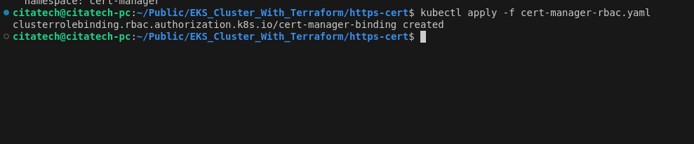

H. Verify the ServiceAccount Configuration
   ```
   kubectl describe serviceaccount cert-manager -n cert-manager
   ```

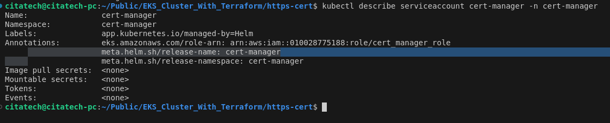


4. Install Cert-Manager using Helm:
   ```
   helm install cert-manager jetstack/cert-manager \
     --namespace cert-manager \
     --version v1.15.3 \
     --set crds.enabled=true
   ```
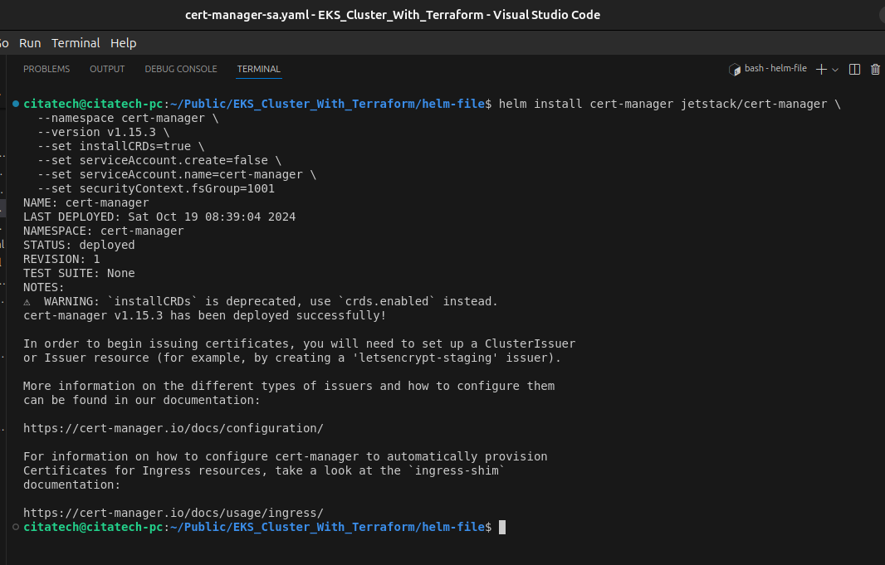


5. Verify the Cert-Manager installation:
   ```
   kubectl get pods --namespace cert-manager
   ```

   Expected output:
   ```
   NAME                                       READY   STATUS    RESTARTS   AGE
   cert-manager-9647b459d-dfr6s               1/1     Running   0          51s
   cert-manager-cainjector-5d8798687c-mlt8f   1/1     Running   0          51s
   cert-manager-webhook-c77744d75-6d7dj       1/1     Running   0          51s
   ```

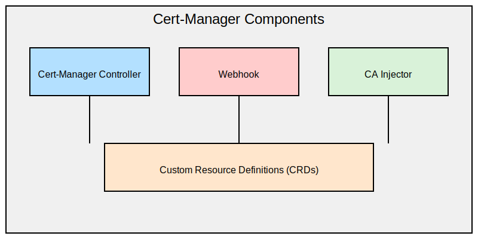


This diagram illustrates the main components of Cert-Manager:

   - Cert-Manager Controller: Manages the certificate lifecycle
   - Webhook: Validates and mutates resources
   - CA Injector: Injects CA bundles into resources
   - Custom Resource Definitions (CRDs): Define custom resources like Certificate, Issuer, and ClusterIssuer


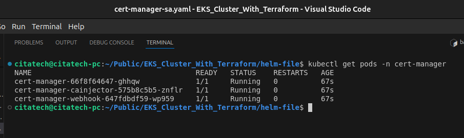


### Step 2: Configure Let's Encrypt Issuer

1. Create a file named `lets-encrypt-issuer.yaml` with the following content:
   ```yaml
   apiVersion: cert-manager.io/v1
   kind: ClusterIssuer
   metadata:
     name: letsencrypt-prod
   spec:
     acme:
       server: https://acme-v02.api.letsencrypt.org/directory
       email: devops@steghub.com
       privateKeySecretRef:
         name: letsencrypt-prod
       solvers:
       - selector:
           dnsZones:
             - "steghub.com"
         dns01:
           route53:
             region: us-east-1
             role: "arn:aws:iam::123456789012:role/cert_manager_role"
             auth:
               kubernetes:
                 serviceAccountRef:
                   name: "cert-manager"
   ```
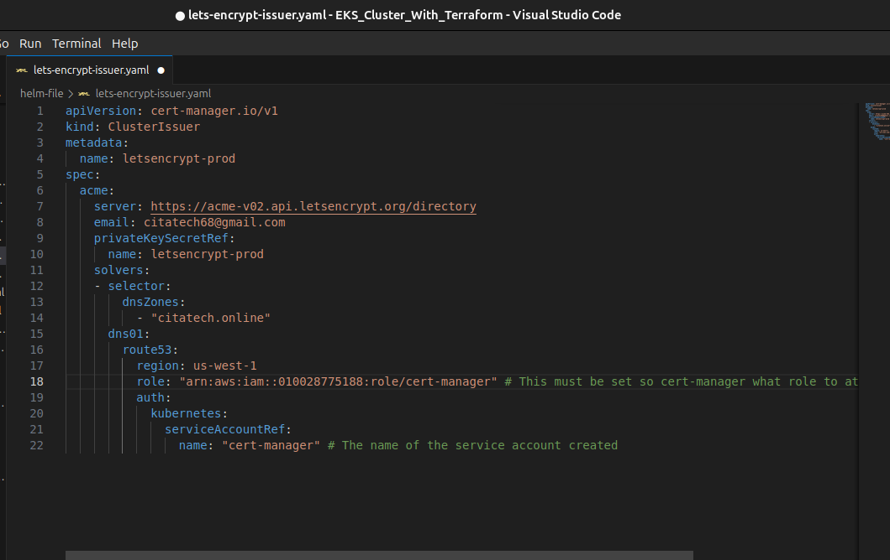

2. Apply the ClusterIssuer:
   ```
   kubectl apply -f lets-encrypt-issuer.yaml
   ```

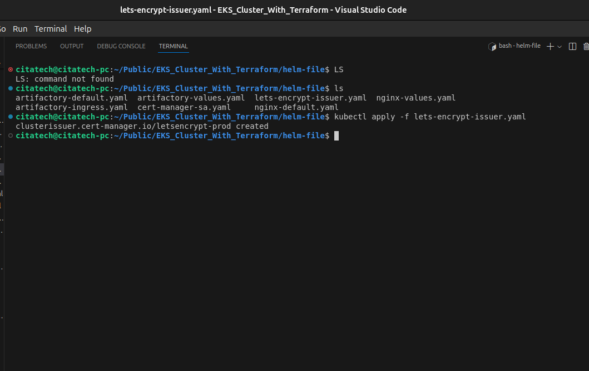


3. Verify the ClusterIssuer:
   ```
   kubectl get clusterissuer
   ```

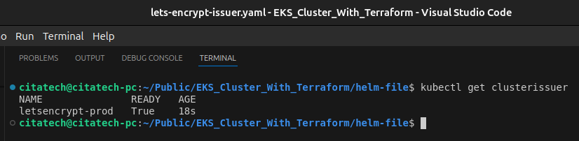


### Step 3: Update Ingress for Artifactory

1. Update your Artifactory Ingress to include TLS configuration:
   ```yaml
   apiVersion: networking.k8s.io/v1
   kind: Ingress
   metadata:
     name: artifactory-ingress
     namespace: tools
     annotations:
       nginx.ingress.kubernetes.io/proxy-body-size: 500m
       service.beta.kubernetes.io/aws-load-balancer-scheme: internet-facing
       service.beta.kubernetes.io/aws-load-balancer-type: nlb
       service.beta.kubernetes.io/aws-load-balancer-backend-protocol: ssl
       service.beta.kubernetes.io/aws-load-balancer-ssl-ports: "443"
       cert-manager.io/cluster-issuer: letsencrypt-prod
       cert-manager.io/private-key-rotation-policy: Always
     labels:
       name: artifactory
   spec:
     ingressClassName: nginx
     tls:
     - hosts:
       - tooling.artifactory.steghub.com
       secretName: tooling.artifactory.steghub.com
     rules:
     - host: tooling.artifactory.steghub.com
       http:
         paths:
         - path: /
           pathType: Prefix
           backend:
             service:
               name: artifactory
               port:
                 number: 8082
   ```
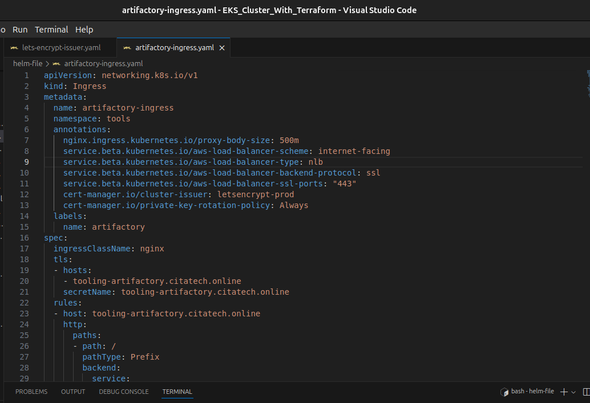


Please make a note of the following information:

- `metadata.annotations`: We have a cert-manager cluster issuer annotation, which points to the ClusterIssuer we previously created. If Cert-Manager observes an Ingress with annotations described in the [Supported Annotations](https://cert-manager.io/docs/usage/ingress/#supported-annotations) section, it will ensure that a Certificate resource with the name provided in the tls.secretName field and configured as described on the Ingress exists in the namespace.

- `spec.tls`: We added the tls block, which determines what ends up in the cert's configuration. The tls.hosts will be added to the cert's subjectAltNames.

- `proxy-body-size`: This is used to set the maximum size of a file we want to allow in our Artifactory. The initial value is lower, so you won't be able to upload a larger size artifact unless you add this annotation. A 413 error will be returned when the size in a request exceeds the maximum allowed size of the client request body.

2. Apply the updated Ingress:
   ```
   kubectl apply -f artifactory-ingress.yaml -n tools
   ```

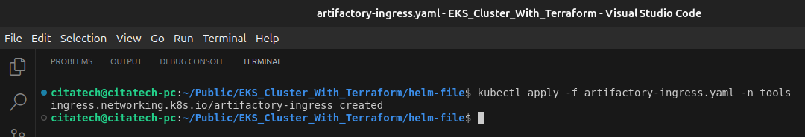


### Step 4: Verify Certificate Issuance

1. Check the status of the Certificate:
   ```
   kubectl get certificate -n tools
   ```
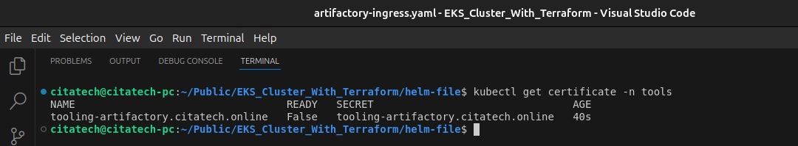

2. Describe the Certificate for more details:
   ```
   kubectl describe certificate artifactory-tls -n tools
   ```
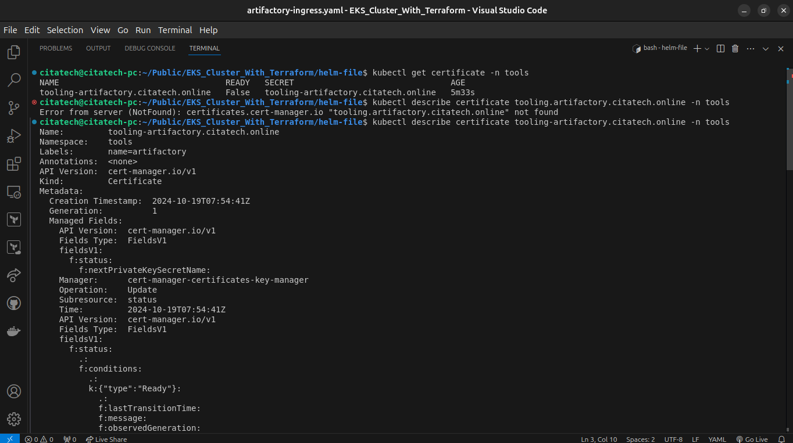
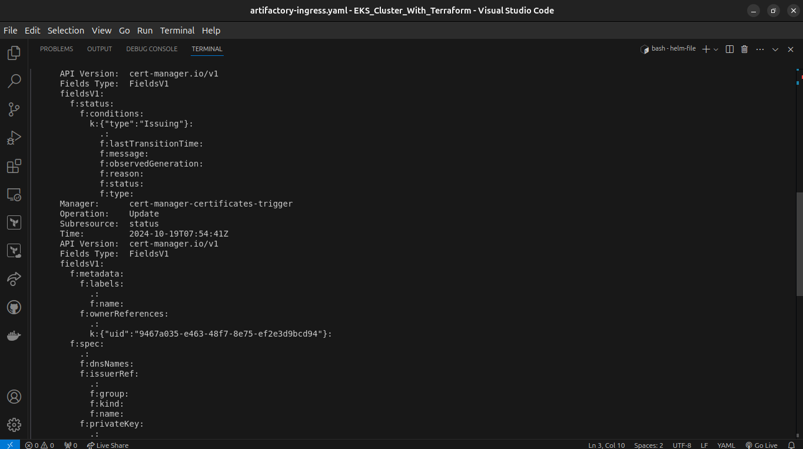
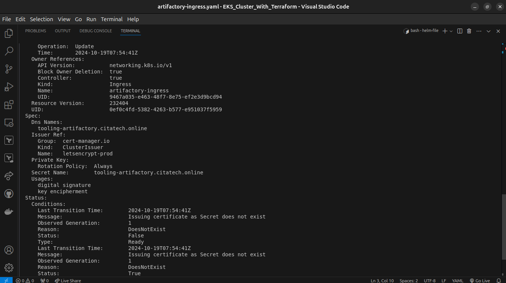
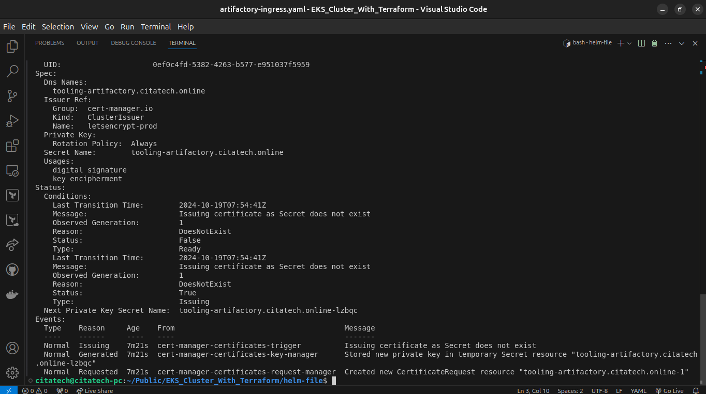


   Initial status:
   ```
   NAME                                                          READY   SECRET                            AGE
   certificate.cert-manager.io/tooling.artifactory.steghub.com   False   tooling.artifactory.steghub.com   86s
   ```


   Final status (after validation):
   ```
   NAME                                                          READY   SECRET                            AGE
   certificate.cert-manager.io/tooling.artifactory.steghub.com   True    tooling.artifactory.steghub.com   10m
   ```

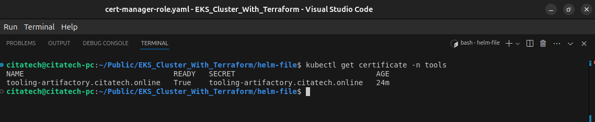

### Step 5: Test HTTPS Access

1. Open a web browser and navigate to `https://tooling.artifactory.citatech.online`
2. Verify that the connection is secure and the certificate is valid:
   - Click on the padlock icon in the address bar
   - View the certificate details
   - Confirm that it's issued by Let's Encrypt

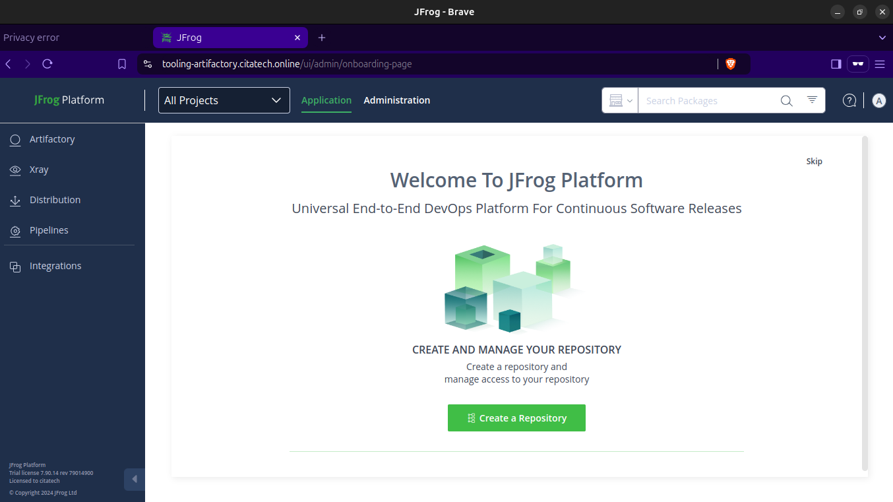


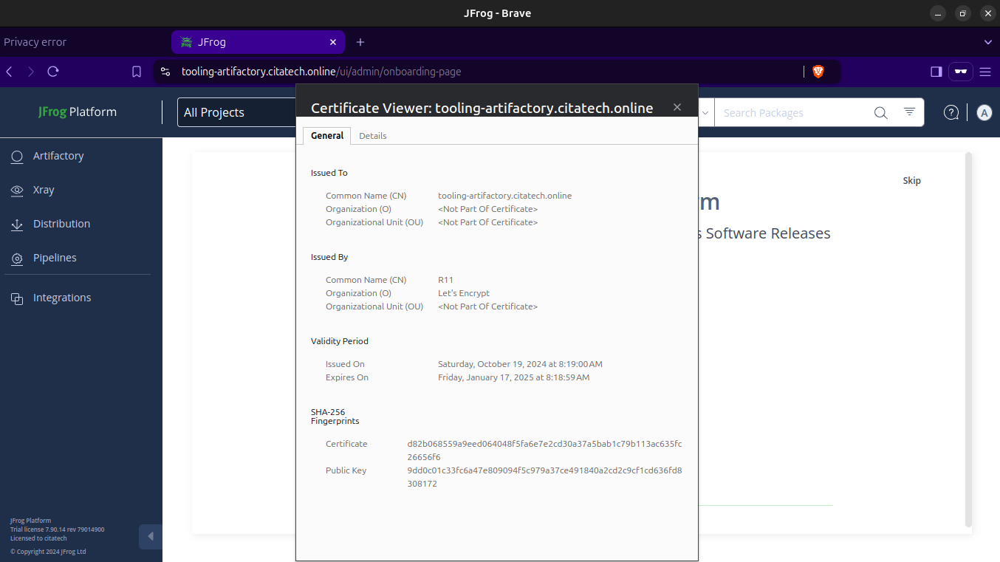

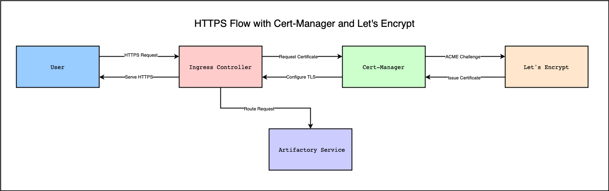

## Conclusion

We've successfully implemented HTTPS for our Artifactory deployment with a trusted SSL/TLS certificate from Let's Encrypt using Cert-Manager. This setup provides automatic certificate management and renewal, ensuring our application remains secure with minimal manual intervention.


## Additional Resources

- [Cert-Manager Documentation](https://cert-manager.io/docs/)
- [Let's Encrypt Documentation](https://letsencrypt.org/docs/)
- [Nginx Ingress Controller Documentation](https://kubernetes.github.io/ingress-nginx/)

