# Migration to the Сloud with containerization (Docker & Docker Compose)1

In this project, we will use a CI tool that is already well-known to us `Jenkins` - for Continous Integration (CI). So, when it is time to write `Jenkinsfile`, we will update our Terraform code to spin up an EC2 instance for Jenkins and run Ansible to install & configure it.

To begin our migration project from VM based workload, we need to implement a `Proof of Concept (POC)`. In many cases, it is good to start with a small-scale project with minimal functionality to prove that technology can fulfill specific requirements. So, this project will be a precursor before you can move on to deploy enterprise-grade microservice solutions with Docker. And so, Project 21 through to 30 will gradually introduce concepts and technologies as we move from POC onto enterprise level deployments.

We can start with our own workstation or spin up an EC2 instance to install Docker engine that will host our Docker containers.

Remember our Tooling website? It is a PHP-based web solution backed by a MySQL database - all technologies we are already familiar with and which we shall be comfortable using by now.

So, let us migrate the Tooling Web Application from a VM-based solution into a containerized one.

## Install Docker and prepare for migration to the Cloud

First, we need to install Docker Engine, which is a client-server application that contains:

- A server with a long-running daemon process dockerd.
- APIs that specify interfaces that programs can use to talk to and instruct the Docker daemon.
- A command-line interface (CLI) client docker.
You can learn how to install Docker Engine on your PC here

# MySQL in container

Let us start assembling our application from the Database layer - we will use a pre-built MySQL database container, configure it, and make sure it is ready to receive requests from our PHP application.

## Step 1: Pull MySQL Docker Image from Docker Hub Registry

Start by pulling the appropriate Docker image for MySQL. We can download a specific version or opt for the latest release, as seen in the following command:

```bash
docker pull mysql/mysql-server:latest
```
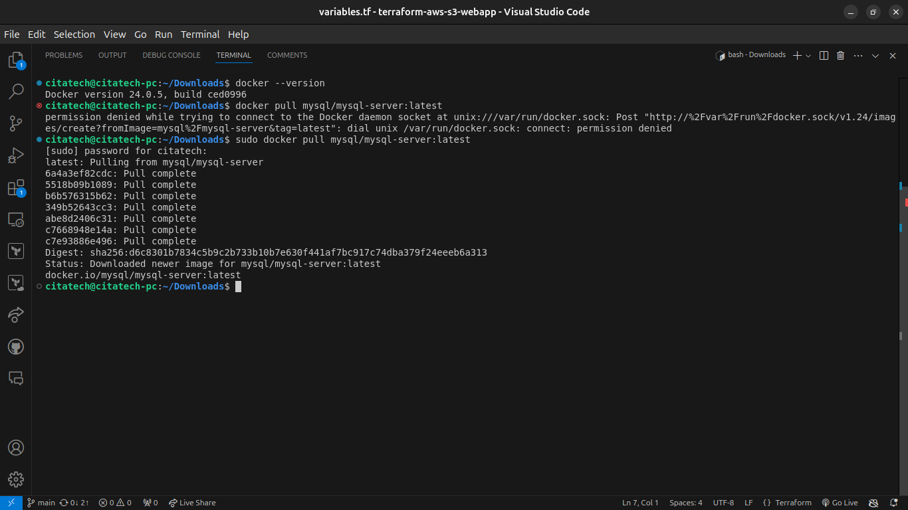

If you are interested in a particular version of MySQL, replace latest with the version number. Visit Docker Hub to check other tags [here](https://hub.docker.com/r/mysql/mysql-cluster/tags)

List the images to check that you have downloaded them successfully:

```bash
docker images ls
```


## Step 2: Deploy the MySQL Container to your Docker Engine

1. Once you have the image, move on to deploying a new MySQL container with:

```bash
docker run --name <container_name> -e MYSQL_ROOT_PASSWORD=<my-secret-pw> -d mysql/mysql-server:latest
```


- Replace <container_name> with the name of your choice. If you do not provide a name, Docker will generate a random one
- The -d option instructs Docker to run the container as a service in the background
- Replace <my-secret-pw> with your chosen password
- In the command above, we used the latest version tag. This tag may differ according to the image you downloaded

2. Then, check to see if the MySQL container is running: Assuming the container name specified is mysql-server

```bash
docker ps -a
```
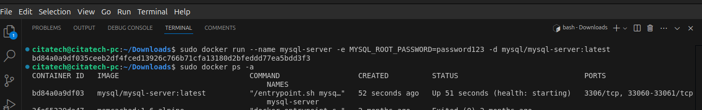

You should see the newly created container listed in the output. It includes container details, one being the status of this virtual environment. The status changes from `health: starting` to `healthy`, once the setup is complete.


## Step 3: Connecting to the MySQL Docker Container

We can either connect directly to the container running the MySQL server or use a second container as a MySQL client. Let us see what the first option looks like.

### Approach 1

Connecting directly to the container running the MySQL server:

```bash
docker exec -it <container_name> mysql -uroot -p
```
Provide the root password when prompted. With that, you have connected the MySQL client to the server.

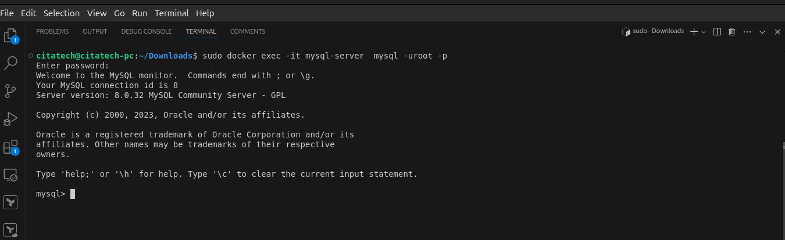


__Finally__, change the server root password to protect your database.

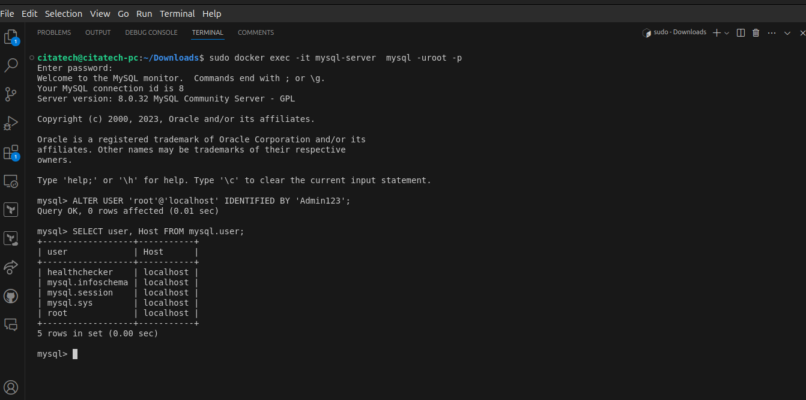

Stop the running container

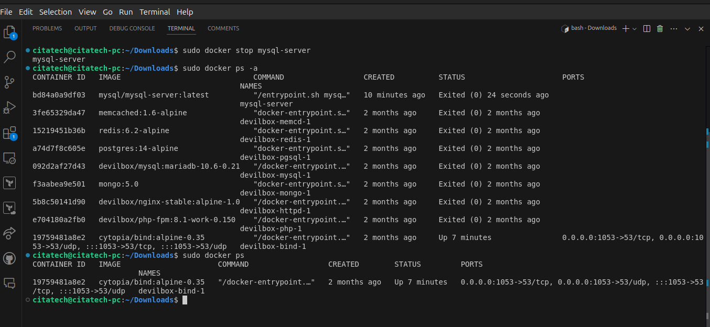

### Approach 2

First, create a network:

```bash
docker network create --subnet=172.18.0.0/24 tooling_app_network
```
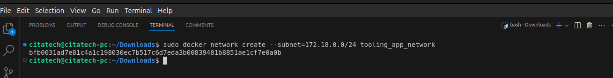

Creating a custom network is not necessary because even if we do not create a network, Docker will use the default network for all the containers you run. By default, the network we created above is of `DRIVER Bridge`. So, also, it is the default network. You can verify this by running the `docker network ls` command.

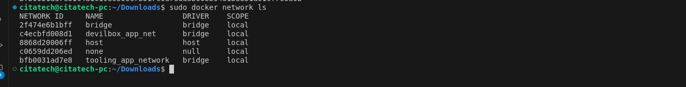

But there are use cases where this is necessary. For example, if there is a requirement to control the `cidr range` of the containers running the entire application stack. This will be an ideal situation to create a network and specify the `--subnet`.

For clarity's sake, we will create a network with a subnet dedicated for our project and use it for both MySQL and the application so that they can connect.

### Run the MySQL Server container using the created network.

First, let us create an environment variable to store the root password:

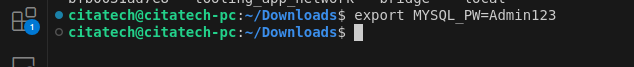

Remove existing container


Then, pull the image and run the container, all in one command like below:

```bash
docker run --network tooling_app_network -h mysqlserverhost --name=mysql-server -e MYSQL_ROOT_PASSWORD=$MYSQL_PW  -d mysql/mysql-server:latest
```
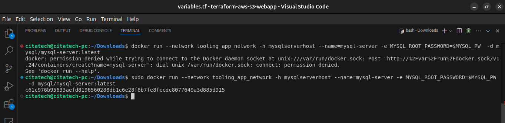

Flags used

- -d runs the container in detached mode
- --network connects a container to a network
- -h specifies a hostname

If the image is not found locally, it will be downloaded from the registry.

Verify the container is running:

```bash
docker ps -a
```
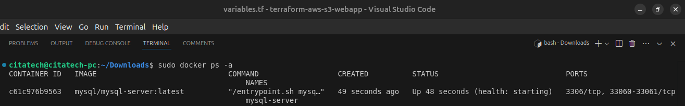

As we already know, it is best practice not to connect to the MySQL server remotely using the root user. Therefore, we will create an `SQL` script that will create a user we can use to connect remotely.

Create a file and name it `create_user.sql` and add the below code in the file:

```sql
CREATE USER '<user>'@'%' IDENTIFIED BY '<client-secret-password>';
GRANT ALL PRIVILEGES ON * . * TO '<user>'@'%';
```

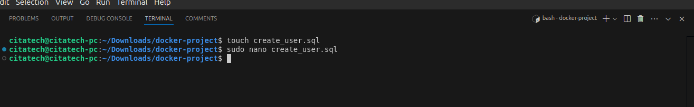

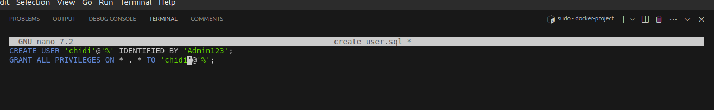

Run the script:

```bash
docker exec -i mysql-server mysql -uroot -p$MYSQL_PW < ./create_user.sql
```

If you see a warning like below, it is acceptable to ignore:

```css
mysql: [Warning] Using a password on the command line interface can be insecure.
```
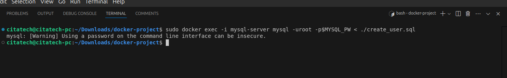

## Connecting to the MySQL server from a second container running the MySQL client utility

The good thing about this approach is that you do not have to install any client tool on your laptop, and you do not need to connect directly to the container running the `MySQL server`.

Run the MySQL Client Container:

```bash
docker run --network tooling_app_network --name mysql-client -it --rm mysql mysql -h mysqlserverhost -u <user-created-from-the-SQL-script> -p
```
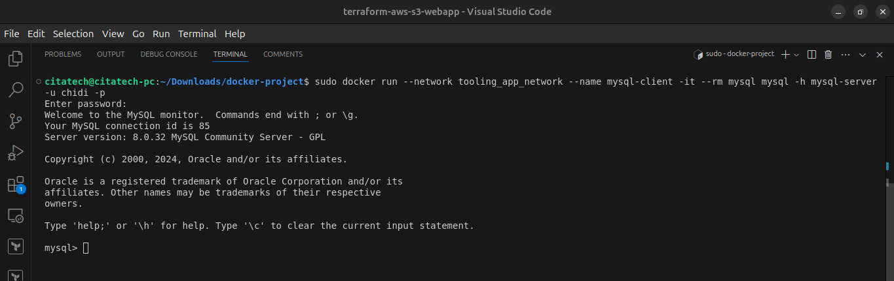

Flags used:

- --name gives the container a name
- -it runs in interactive mode and Allocate a pseudo-TTY
- --rm automatically removes the container when it exits
- --network connects a container to a network
- -h a MySQL flag specifying the MySQL server Container hostname
- -u user created from the SQL script
- -p password specified for the user created from the SQL script

# Prepare database schema

Now you need to prepare a database schema so that the Tooling application can connect to it.

## 1. Clone the Tooling-app repository from [here](https://github.com/StegTechHub/tooling-02)

```bash
git clone https://github.com/StegTechHub/tooling-02.git
```
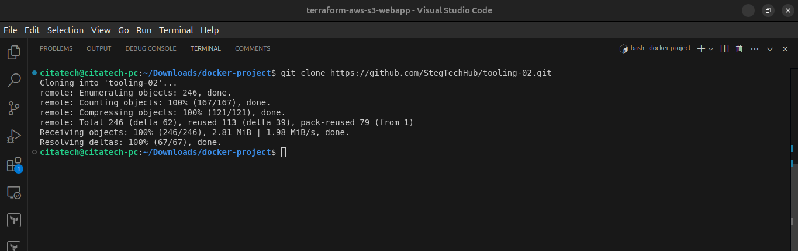

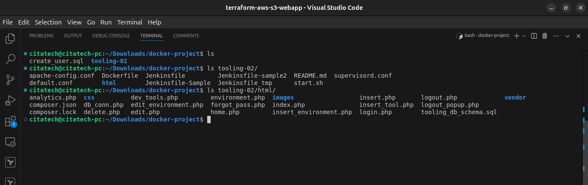

## 2. On the terminal, export the location of the SQL file

```bash
export tooling_db_schema=<path-to-tooling-schema-file>/tooling_db_schema.sql
```
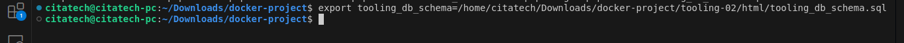

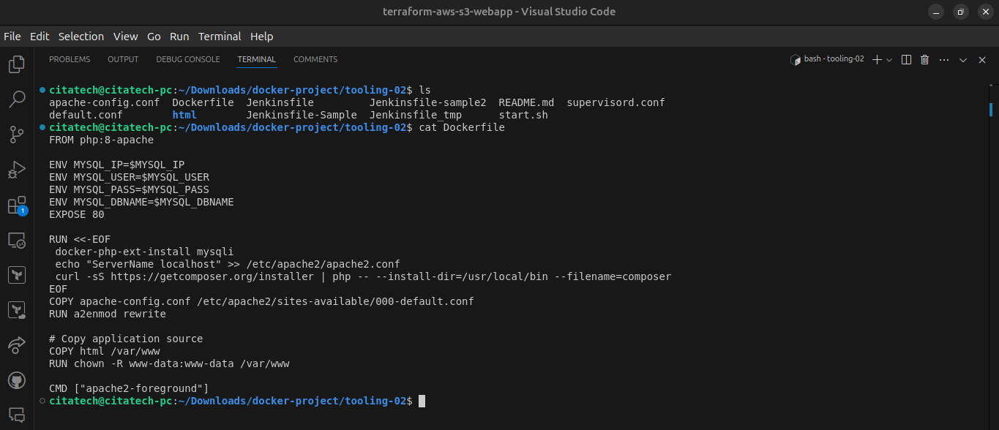

You can find the tooling_db_schema.sql in the html folder of cloned repo.

## 3. Use the SQL script to create the database and prepare the schema. With the `docker exec` command, we can execute a command in a running container.

```bash
docker exec -i mysql-server mysql -uroot -p$MYSQL_PW < $tooling_db_schema
```
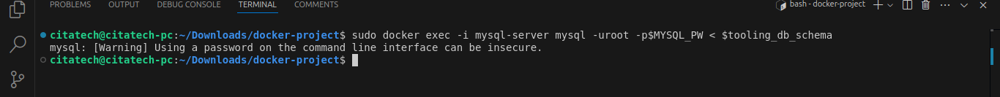

## 4. Update the db_conn.php file with connection details to the database

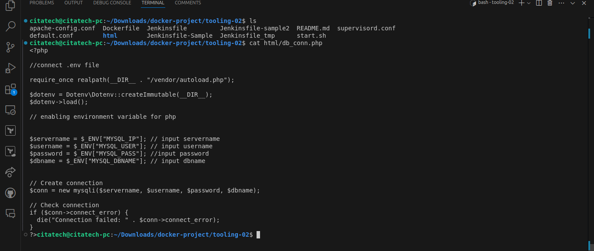

- Create a .env file in tooling/html/.env with connection details to the database.

```bash
sudo vim .env

MYSQL_IP=mysqlserverhost
MYSQL_USER=username
MYSQL_PASS=client-secrete-password
MYSQL_DBNAME=toolingdb
```
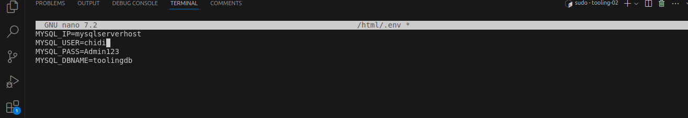

Flags used:

- __MYSQL_IP:__ mysql ip address "leave as mysqlserverhost"
- __MYSQL_USER:__ mysql username for user exported as environment variable
- __MYSQL_PASS:__ mysql password for the user exported as environment varaible
- __MYSQL_DBNAME:__ mysql databse name "toolingdb"

## 5. Run the Tooling App

`Containerization` of an application starts with creation of a file with a special name - `Dockerfile` (without any extensions). This can be considered as a 'recipe' or 'instruction' that tells Docker how to pack your application into a container.
In this project, we will build our container from a pre-created `Dockerfile`, but as a `DevOps`, we must also be able to write `Dockerfiles`.

You can watch [this video](https://www.youtube.com/watch?v=hnxI-K10auY) to get an idea how to create your Dockerfile and build a container from it.

And on [this page](https://docs.docker.com/build/building/best-practices/), you can find official Docker best practices for writing Dockerfiles.

So, let us `containerize` our `Tooling application`; here is the plan:

- Make sure you have checked out your Tooling repo to your machine with Docker engine
- First, we need to build the Docker image the tooling app will use. The Tooling repo you cloned above has a `Dockerfile` for this purpose. Explore it and make sure you understand the code inside it.
- Run `docker build` command
- Launch the container with `docker run`
- Try to access your application via port exposed from a container

__Let us begin:__

Ensure you are inside the folder that has the Dockerfile and build your container:


```bash
docker build -t tooling:0.0.1 .
```
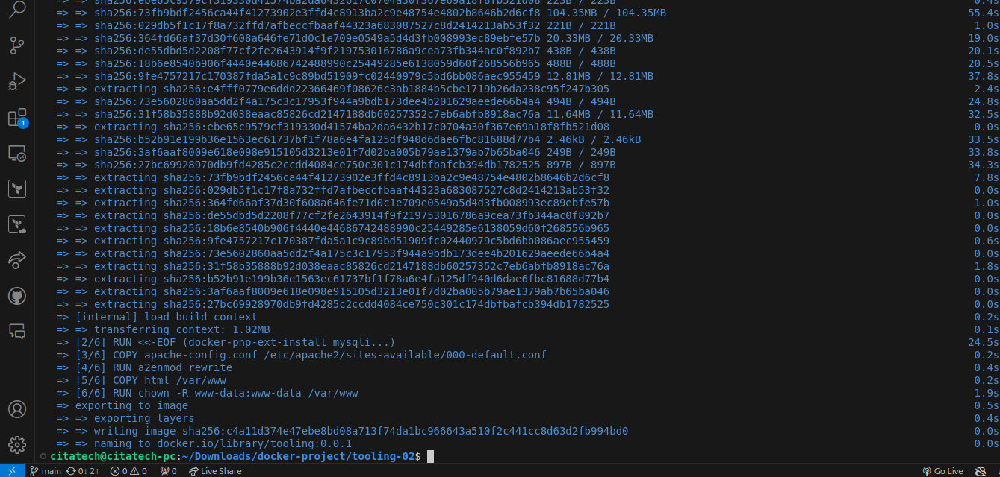


In the above command, we specify a parameter `-t`, so that the image can be tagged `tooling:0.0.1` - Also, you have to notice the `.` at the end. This is important as that tells Docker to locate the `Dockerfile` in the current directory you are running the command. Otherwise, you would need to specify the absolute path to the `Dockerfile`.

## 6. Run the container:

```bash
docker run --network tooling_app_network -p 8085:80 -it tooling:0.0.1
```
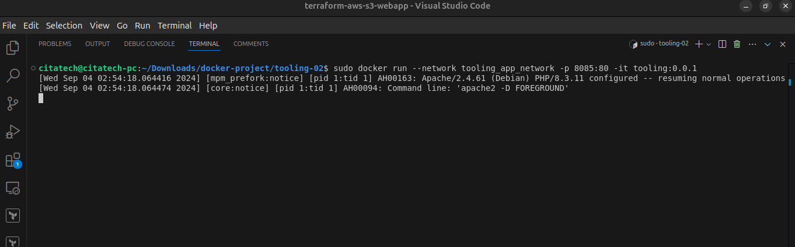

Let us observe those flags in the command.

- We need to specify the `--network` flag so that both the Tooling app and the database can easily connect on the same virtual network we created earlier.

- The `-p` flag is used to map the container port with the host port. Within the container, `apache` is the webserver running and, by default, it listens on port 80. You can confirm this with the CMD [`start-apache`] section of the Dockerfile. But we cannot directly use `port 80` on our host machine because it is already in use. The workaround is to use another port that is not used by the host machine. In our case, `port 8085` is free, so we can map that to port 80 running in the container.

__Note:__ You will get an `error`. But you must troubleshoot this error and fix it. Below is your error message.

```css
AH00558: apache2: Could not reliably determine the server's fully qualified domain name, using 172.18.0.3. Set the 'ServerName' directive globally to suppress this message
```
__Hint:__ You must have faced this error in some of the past projects. It is time to begin to put your skills to good use. Simply do a google search of the error message, and figure out where to update the configuration file to get the error out of your way.

If everything works, you can open the browser and type `http://localhost:8085`

You will see the login page.

The default email is `test@gmail.com`, the password is `12345` or you can check users' credentials stored in the `toolingdb.user table`.

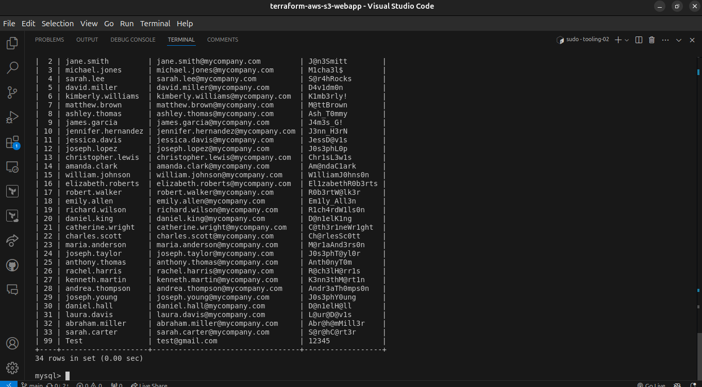

__Here's my first error__

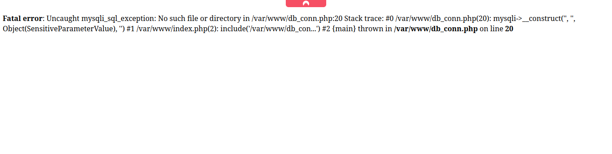


## Troubleshooting

Using the `ENV` instruction in the Dockerfile like this:

```Dockerfile
ENV MYSQL_IP=$MYSQL_IP
ENV MYSQL_USER=$MYSQL_USER
ENV MYSQL_PASS=$MYSQL_PASS
ENV MYSQL_DBNAME=$MYSQL_DBNAME
```
did not work as intended for dynamically injecting values from `.env` file at build time. Here’s why:

1. __Build-Time Context:__ When Docker builds an image, it does not have access to `environment variables` from the *`host system`* or any *`.env`* file unless you explicitly pass them in. The variables `$MYSQL_IP`, `$MYSQL_USER`, `$MYSQL_PASS`, and `$MYSQL_DBNAME` will not be replaced with values from a .env file or the host environment because Docker does not interpret these at build time.

2.	__Result of Current ENV Usage:__ As a result, when we use ENV like `ENV MYSQL_IP=$MYSQL_IP`, Docker interprets this as setting the environment variable MYSQL_IP to an empty string unless those variables are explicitly passed to Docker at build time using the *`--build-arg option`*.

To *`dynamically`* pass environment variables from a *`.env`* file or shell environment, consider this approache:

### Using `--env-file` for Runtime Variables

For runtime environment variables, you should pass them when running the container, not at build time. This allows for more flexibility and keeps Docker images more environment-agnostic and is generally the preferred approach for configuration.

Dockerfile Without Hardcoded ENV Variables:

```Dockerfile
FROM php:8-apache

# Install necessary PHP extensions and tools
RUN apt-get update && apt-get install -y git zip unzip

RUN <<-EOF
 docker-php-ext-install mysqli
 echo "ServerName localhost" >> /etc/apache2/apache2.conf
 # Install Composer
 curl -sS https://getcomposer.org/installer | php -- --install-dir=/usr/local/bin --filename=composer
EOF

# Copy Apache configuration
COPY apache-config.conf /etc/apache2/sites-available/000-default.conf
RUN a2enmod rewrite

# Copy application source and set permissions
COPY html /var/www
RUN chown -R www-data:www-data /var/www

# Install Composer dependencies
WORKDIR /var/www
RUN composer install

# Expose port and start Apache
EXPOSE 80
CMD ["apache2-foreground"]
```

__`php:<version>-apache`__ base image contains Debian's Apache httpd in conjunction with PHP. See [official PHP image on Docker Hub](https://hub.docker.com/_/php). As such, we can use `apt-get` command for installations.

### Let's Run the container again adding `--env-file .env`

```Docker
docker run --network tooling_app_network --env-file html/.env -p 8085:80 -it tooling:0.0.1
```


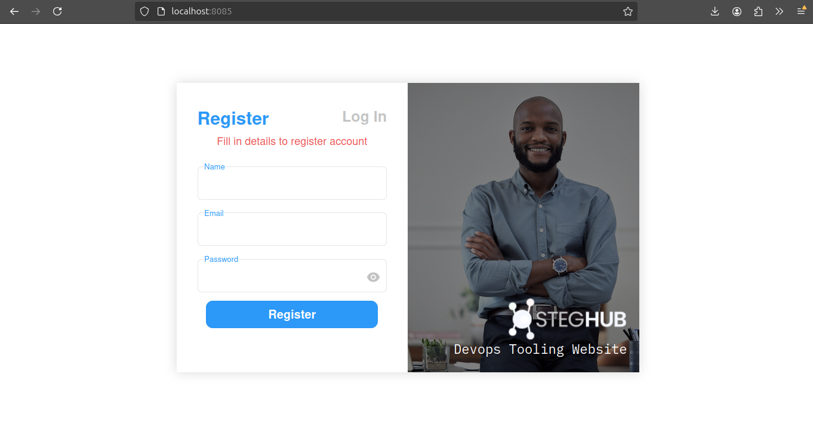

# Practice Task №1 - Implement a POC to migrate the PHP-Todo app into a containerized application.

Download php-todo repository [from here](https://github.com/StegTechHub/php-todo)

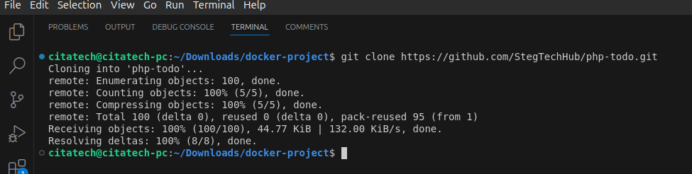

The project below will challenge you a little bit, but the experience there is very valuable for future projects.

## Part 1

Here is the [todo-app repository](https://github.com/citadelict/php-todo-containerization.git) for part 1 - 3

### 1. Write a Dockerfile for the TODO app

__Dokerfile__

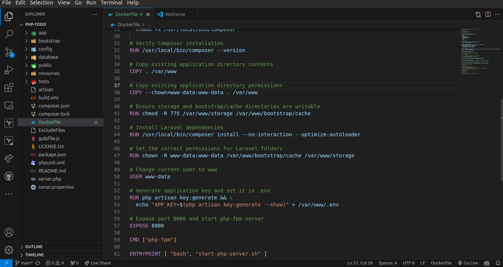


### 2. Run both database and app on your laptop Docker Engine

__Run database container__

```docker
docker run --network tooling_app_network -h mysqlserverhost --name=mysql-server -e MYSQL_ROOT_PASSWORD=$MYSQL_PW  -d mysql/mysql-server:latest
```
Create a script `create_user.sql` to create database and user

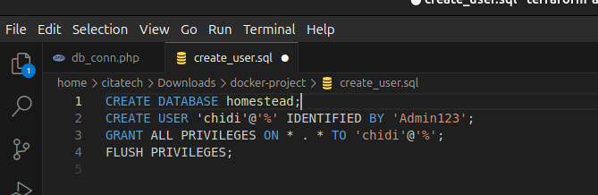

Create database and user using the script

```docker
docker exec -i mysql-server mysql -uroot -p$MYSQL_PW < ./create_user.sql
```
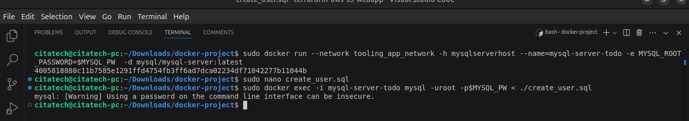

__Run todo app__

Build the todo app

```docker
docker build -t php-todo:0.0.1 .
```
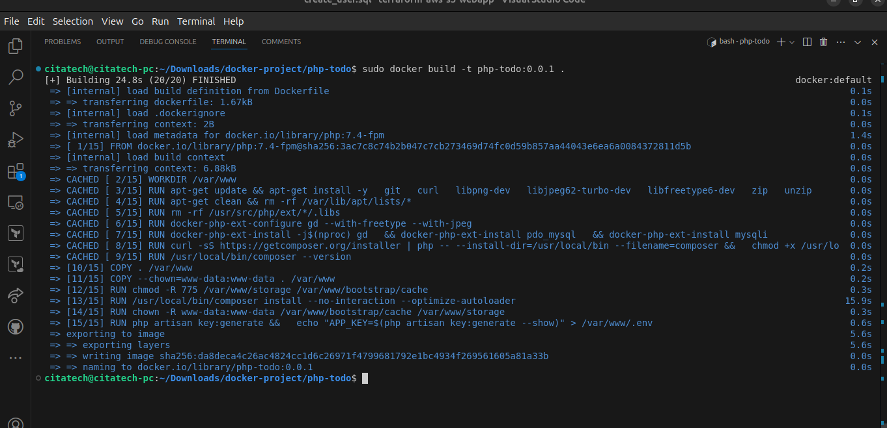


```docker
docker run --network tooling_app_network --rm --name php-todo --env-file .env -p 8090:8000 -it php-todo:0.0.1
```
Migration has taken place in the prvious run


### 3. Access the application from the browser

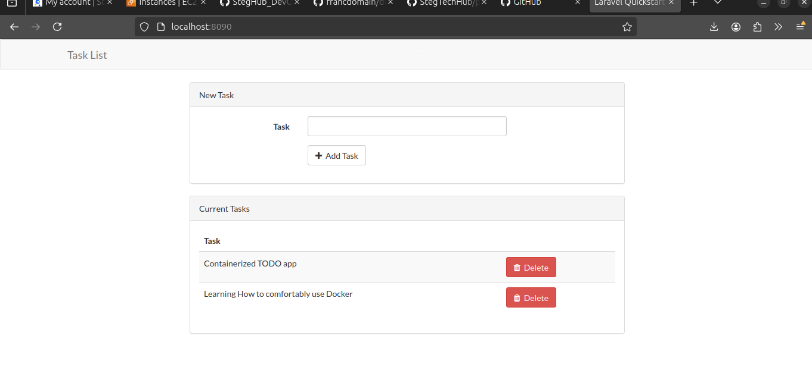


## Part 2

### 1. Create an account in [Docker Hub](https://hub.docker.com/)

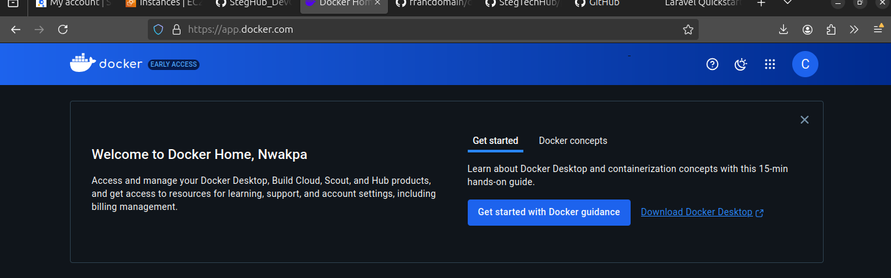

### 2. Create a new Docker Hub repository

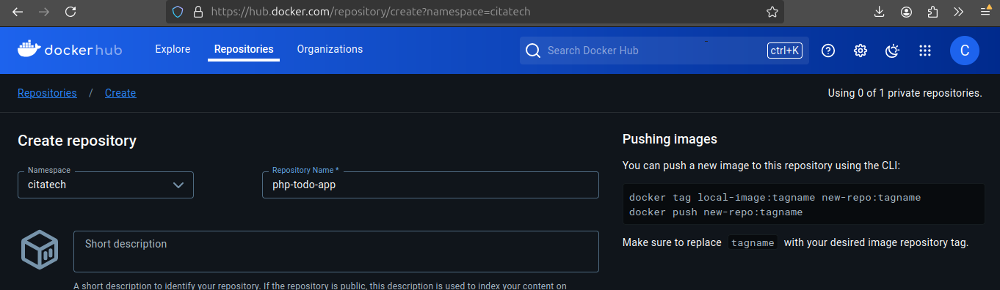

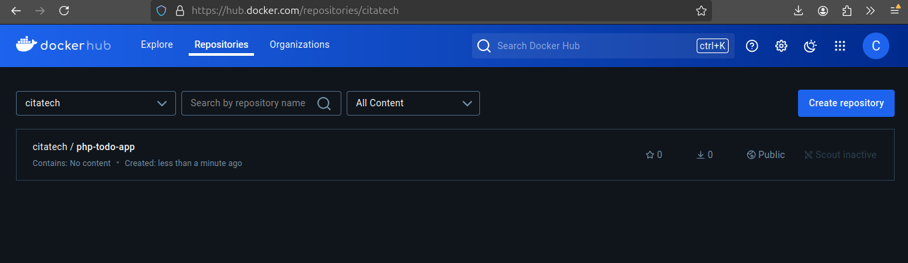

### 3. Push the docker images from your PC to the repository

Sign in to docker and tag the docker image

```docker
docker login

docker tag php-todo:0.0.1 citatech/php-todo-app:0.0.1
```
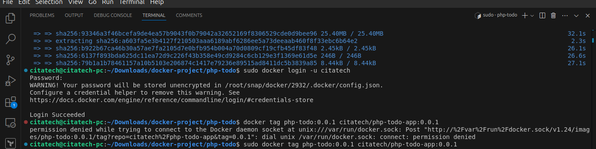

Push the docker image to the repository created

```docker
docker push citatech/php-todo-app:0.0.1
```
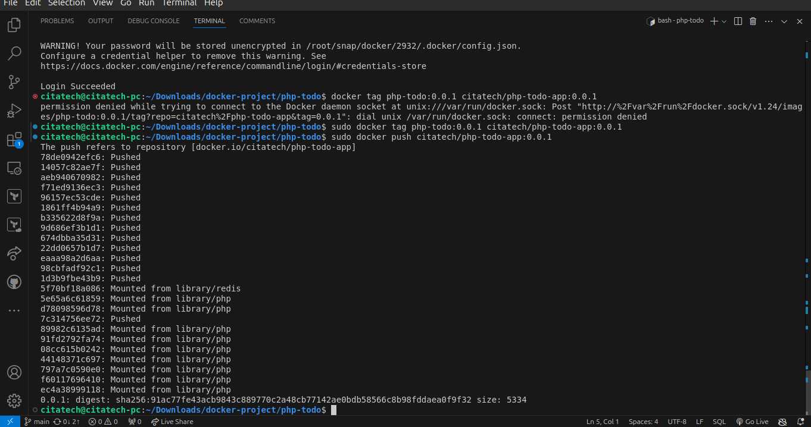

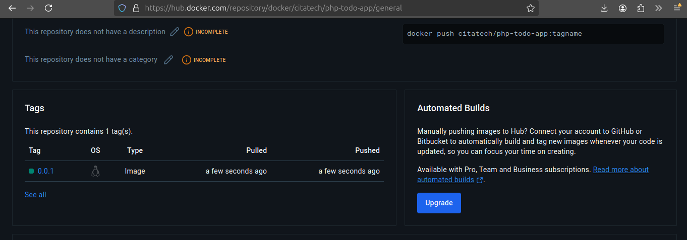

## Part 3

### 1. Write a Jenkinsfile that will simulate a Docker Build and a Docker Push to the registry

```groovy
pipeline {
    agent any

    environment {
        DOCKER_REGISTRY = "docker.io"
        DOCKER_IMAGE = "citatech/php-todo-app"
    }

    stages {
        stage("Initial cleanup") {
            steps {
                dir("${WORKSPACE}") {
                    deleteDir()
                }
            }
        }

        stage('Checkout') {
            steps {
                checkout scm
            }
        }

        stage('Build Docker Image') {
            steps {
                script {
                    def branchName = env.BRANCH_NAME
                    // Define tagName outside the script block for reuse
                    env.TAG_NAME = branchName == 'main' ? 'latest' : "${branchName}-0.0.${env.BUILD_NUMBER}"

                    // Build Docker image
                    sh """
                    docker build -t ${DOCKER_REGISTRY}/${DOCKER_IMAGE}:${env.TAG_NAME} .
                    """
                }
            }
        }

        stage('Push Docker Image') {
            steps {
                script {
                    // Use Jenkins credentials to login to Docker and push the image
                    withCredentials([usernamePassword(credentialsId: 'docker-credentials', usernameVariable: 'USERNAME', passwordVariable: 'PASSWORD')]) {
                        sh """
                        echo ${PASSWORD} | docker login -u ${USERNAME} --password-stdin ${DOCKER_REGISTRY}
                        docker push ${DOCKER_REGISTRY}/${DOCKER_IMAGE}:${env.TAG_NAME}
                        """
                    }
                }
            }
        }

        stage('Cleanup Docker Images') {
            steps {
                script {
                    // Clean up Docker images to save space
                    sh """
                    docker rmi ${DOCKER_REGISTRY}/${DOCKER_IMAGE}:${env.TAG_NAME} || true
                    """
                }
            }
        }
    }
}
```
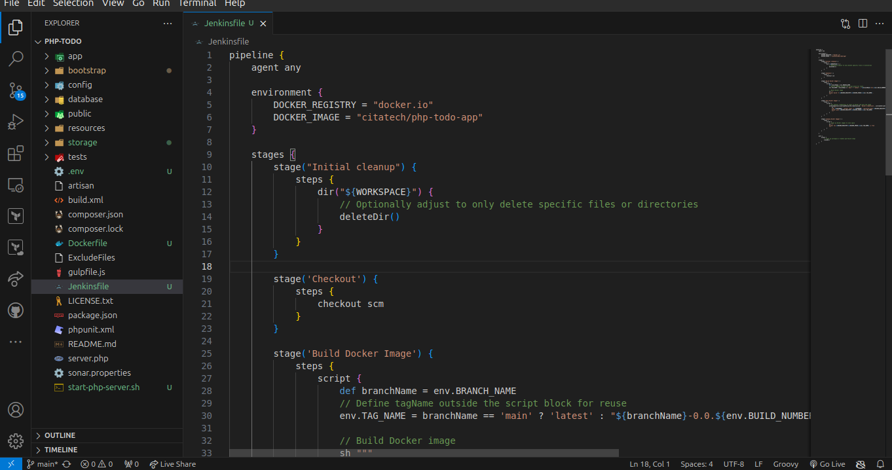

Launch ec2 instance for jenkins

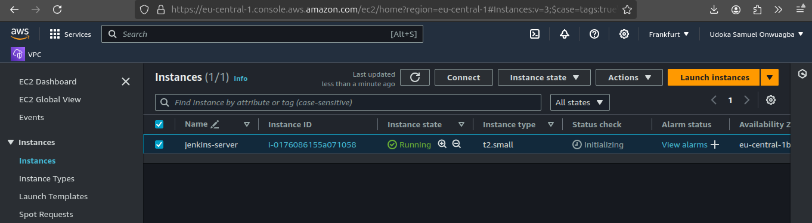

#### Install docker on jenkins server

- Set up Docker's `apt` repository.

```bash
# Add Docker's official GPG key:
sudo apt-get update

sudo apt-get install ca-certificates curl

sudo install -m 0755 -d /etc/apt/keyrings

sudo curl -fsSL https://download.docker.com/linux/ubuntu/gpg -o /etc/apt/keyrings/docker.asc

sudo chmod a+r /etc/apt/keyrings/docker.asc

# Add the repository to Apt sources:
echo \
  "deb [arch=$(dpkg --print-architecture) signed-by=/etc/apt/keyrings/docker.asc] https://download.docker.com/linux/ubuntu \
  $(. /etc/os-release && echo "$VERSION_CODENAME") stable" | \
  sudo tee /etc/apt/sources.list.d/docker.list > /dev/null

sudo apt-get update

sudo systemctl start docker
sudo systemctl enable docker
```
- Install the Docker packages.
  To install the latest version, run:

```bash
sudo apt-get install docker-ce docker-ce-cli containerd.io docker-buildx-plugin docker-compose-plugin
```
#### Ensure Jenkins Has Permission to Run Docker
- Add Jenkins User to Docker Group

```bash
sudo usermod -aG docker jenkins

sudo systemctl restart jenkins
```
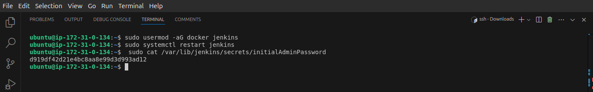

#### Install docker plugins

- Go to Manage Jenkins > Manage Plugins > Available.
- Search for Docker Pipeline and install it.

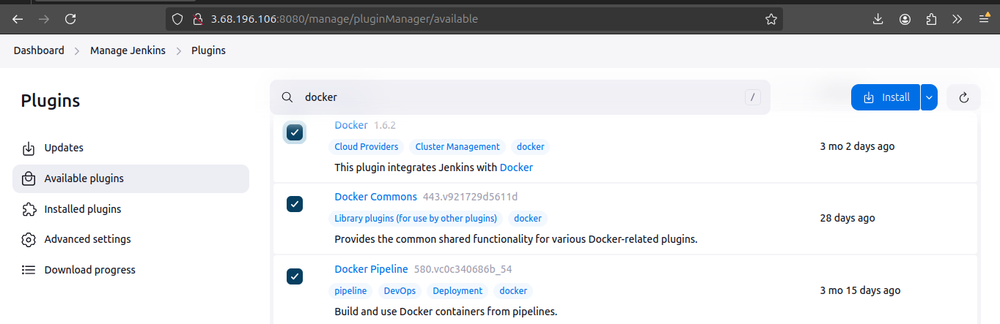

#### Docker Tool Configuration:

- Check the path to Docker executable (Installed docker) by running
```bash
which docker
```


- Go to Manage Jenkins > Tools, Scrol to Docker installations

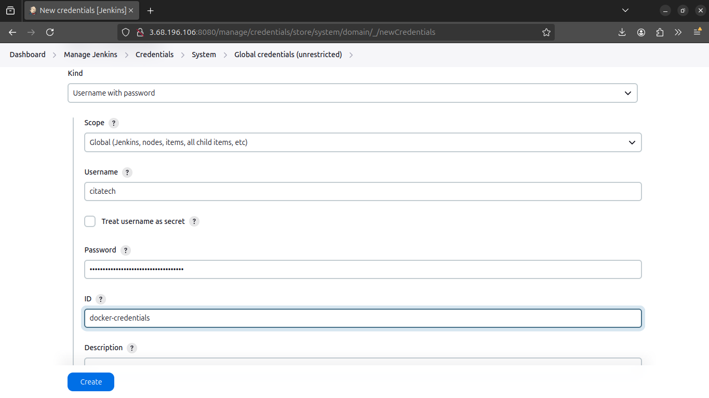

#### Add Docker credentials to Jenkins.

- Go to Jenkins Dashboard > Manage Jenkins > Credentials.
  Add your Docker `username` and `password` and the credential ID (from jenkinsfile) there.

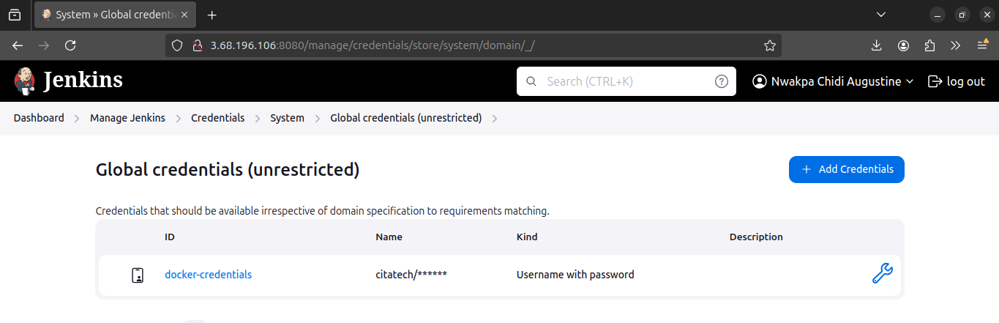


### 2. Connect your repo to Jenkins

Add a webhook to the github repo

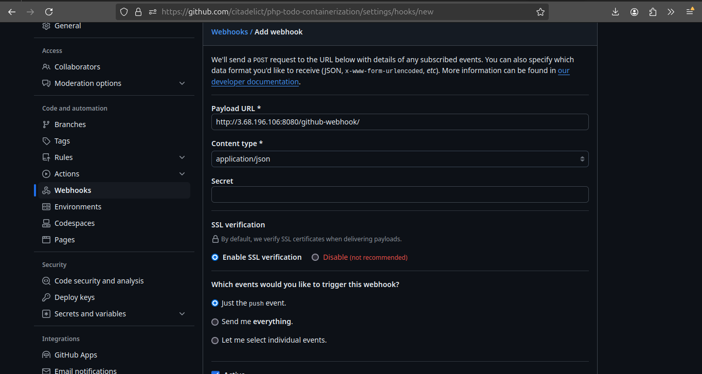

- Install Blue Ocean plugin and Open it from dashboard
- Select create New pipeline
- Select Github and your Github account
- Select the repo for the pipeline
- Select create pipeline

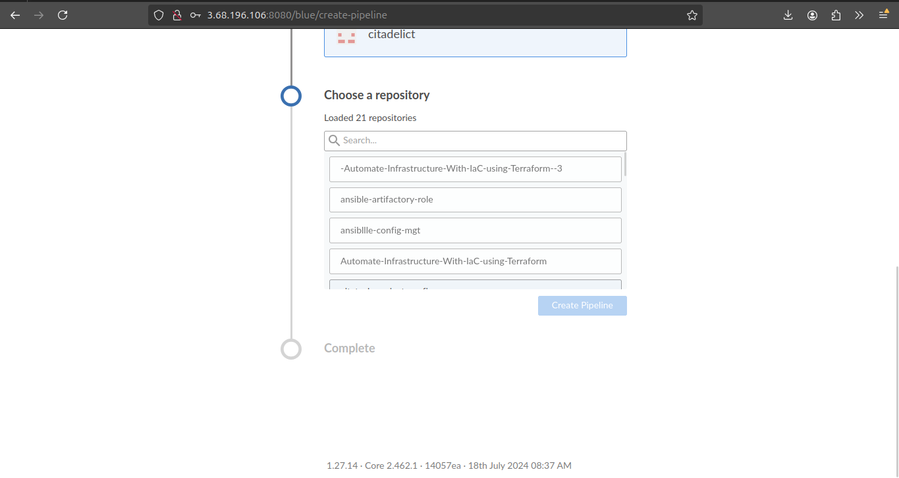


### 3. Create a multi-branch pipeline


### 4. Simulate a CI pipeline from a feature and master branch using previously created Jenkinsfile

__For Feature branch__


__For Main branch__

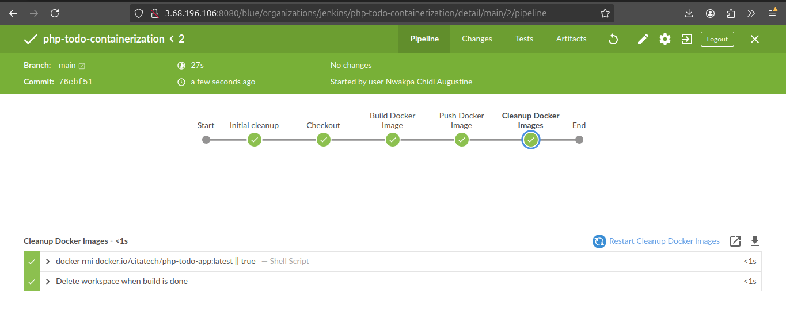

#### 5. Ensure that the tagged images from your Jenkinsfile have a prefix that suggests which branch the image was pushed from. For example, feature-0.0.1.
#### 6. Verify that the images pushed from the CI can be found at the registry.


# Deployment with Docker Compose

All we have done until now required quite a lot of effort to create an image and launch an application inside it. We should not have to always run Docker commands on the terminal to get our applications up and running. There are solutions that make it easy to write [declarative code](https://en.wikipedia.org/wiki/Declarative_programming) in [YAML](https://en.wikipedia.org/wiki/YAML), and get all the applications and dependencies up and running with minimal effort by launching a single command.

In this section, we will refactor the `Tooling app` POC so that we can leverage the power of `Docker Compose`.

### 1. First, install Docker Compose on your workstation from [here](https://docs.docker.com/compose/install/)

With `Docker Desktop`, Docker Compose is now integrated as a `Docker CLI plugin`, and you use it by typing `docker compose` instead of `docker-compose` (for stand alone docker compose tool).


#### 2. Create a file, name it tooling.yaml
#### 3. Begin to write the Docker Compose definitions with YAML syntax. The YAML file is used for defining services, networks, and volumes:

```yaml
version: "3.9"
services:
  tooling_frontend:
    build: .
    ports:
      - "5000:80"
    volumes:
      - tooling_frontend:/var/www/html
```
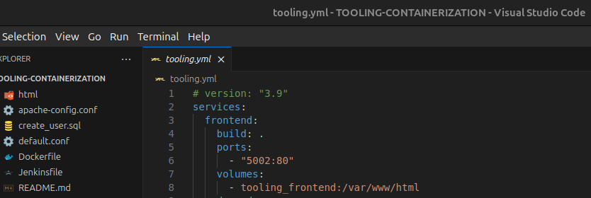

The YAML file has declarative fields, and it is vital to understand what they are used for.

- __version:__ Is used to specify the version of Docker Compose API that the Docker Compose engine will connect to. This field is optional from docker compose version v1.27.0.

- __service:__ A service definition contains a configuration that is applied to each container started for that service. In the snippet above, the only service listed there is `tooling_frontend`. So, every other field under the tooling_frontend service will execute some commands that relate only to that service. Therefore, all the below-listed fields relate to the tooling_frontend service.
- __build__
- __port__
- __volumes__
- __links__

You can visit the site [here](https://www.balena.io/docs/reference/supervisor/docker-compose/) to find all the fields and read about each one that currently matters to you.

You may also go directly to the official documentation site to read about each field [here](https://docs.docker.com/compose/compose-file/compose-file-v3/).

Let us fill up the entire file and test our application:

```yaml
version: "3.9"
services:
  tooling_frontend:
    build: .
    ports:
      - "5001:80"
    volumes:
      - tooling_frontend:/var/www/html
    links:
      - db
  db:
    image: mysql:5.7
    restart: always
    environment:
      MYSQL_DATABASE: <The database name required by Tooling app >
      MYSQL_USER: <The user required by Tooling app >
      MYSQL_PASSWORD: <The password required by Tooling app >
      MYSQL_RANDOM_ROOT_PASSWORD: '1'
    volumes:
      - db:/var/lib/mysql
volumes:
  tooling_frontend:
  db:
```
Run the command to start the containers

```docker
docker-compose -f tooling.yaml  up -d
```
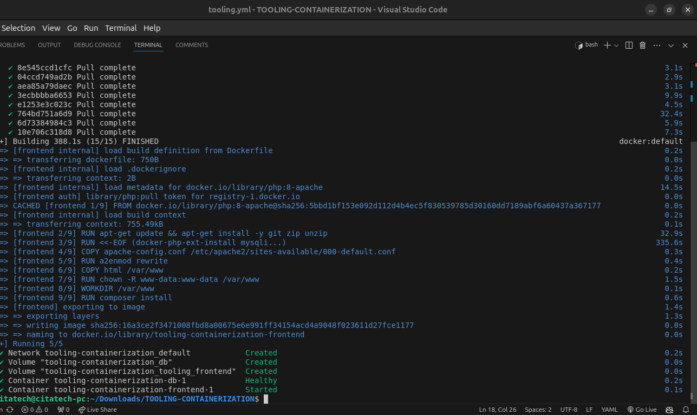

Verify that the compose is in the running status:

```docker
docker compose ls
```
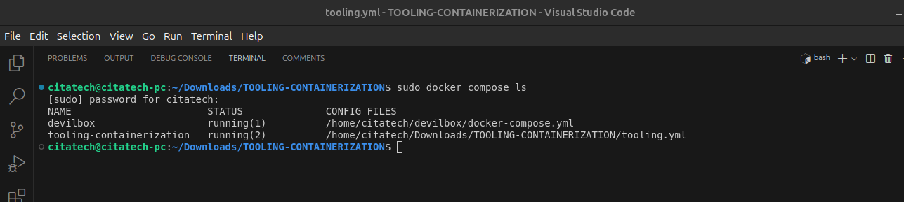

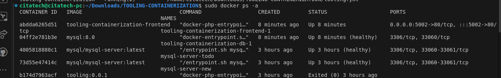

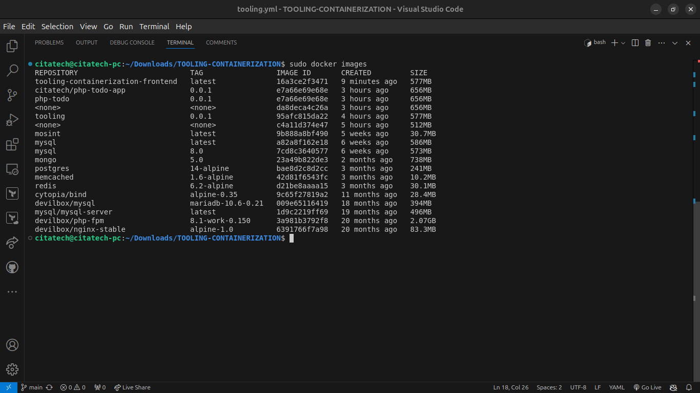

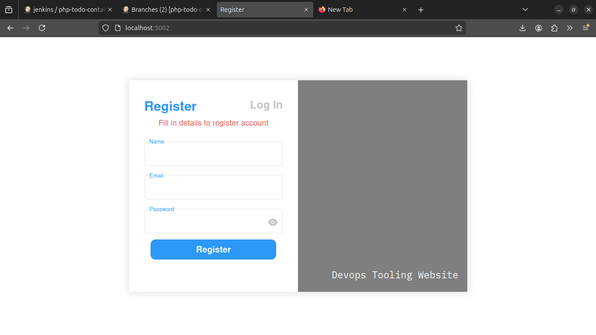


# Practice Task №2 - Complete Continous Integration With A Test Stage

### 1. Document your understanding of all the fields specified in the Docker Compose file `tooling.yaml`

__Version:__
This specifies the version of the Docker Compose file format being used, which in this case is version 3.9.

__Services:__
The services section defines the containers that will be run as part of this Docker Compose setup.

- __frontend Service:__
  - __build .__: This tells Docker to build an image from a Dockerfile in the current directory (.).
  - __ports:__ "5001:80": Maps port 5001 on the host machine to port 80 on the container, allowing access to the frontend service from outside.
  - __volumes:__:
	-	__tooling_frontend:/var/www/html:__ This mounts a named volume tooling_frontend to the path /var/www/html inside the container. This is useful for persisting data or sharing data between containers.
  - __links:__ - db
    - Enables the frontend service to connect to the db service using the hostname `db`.

- __db Service:__
  - __image: mysql:5.7:__ Specifies the MySQL version 5.7 Docker image to be used for this service.
  - __restart: always:__ Configures the container to always restart if it stops, ensuring high availability.
  - __environment:__: Sets environment variables for the MySQL container:

    - MYSQL_DATABASE: The name of the database to create.

    - MYSQL_USER: The username for the MySQL user.

    - MYSQL_PASSWORD: The password for the MySQL user.
    - MYSQL_RANDOM_ROOT_PASSWORD: A flag to generate a random root password.

  - __volumes:__:
    - __db:/var/lib/mysql:__ Uses a named volume db to persist MySQL data, storing it in /var/lib/mysql inside the container.

__Volumes:__
This section declares two named volumes, `tooling_frontend` and `db`, which are used by the frontend and db services respectively for persistent storage.

### 2. Update your `Jenkinsfile` with a `test stage` before pushing the image to the registry.

See repository [here](https://github.com/citadelict/TOOLING-CONTAINERIZATION)


__Install `docker compose` on jenkins server__

```bash
sudo apt update

LATEST_COMPOSE_VERSION=$(curl -s https://api.github.com/repos/docker/compose/releases/latest | grep '"tag_name":' | sed -E 's/.*"v([^"]+)".*/\1/')

sudo curl -L "https://github.com/docker/compose/releases/download/v${LATEST_COMPOSE_VERSION}/docker-compose-$(uname -s)-$(uname -m)" -o /usr/local/bin/docker-compose

sudo chmod +x /usr/local/bin/docker-compose
docker-compose --version

sudo systemctl restart jenkins
```
Install docker compose plugin

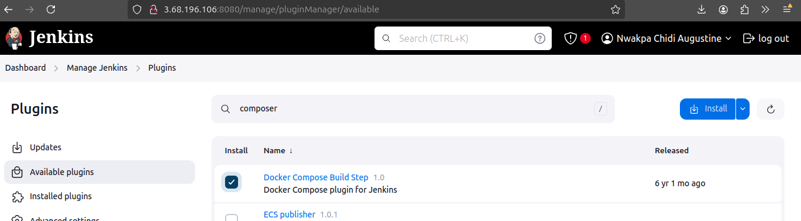

Add a webhook


### 3. What you will be testing here is to ensure that the `tooling site` http endpoint is able to return status `code 200`. Any other code will be determined a stage failure.

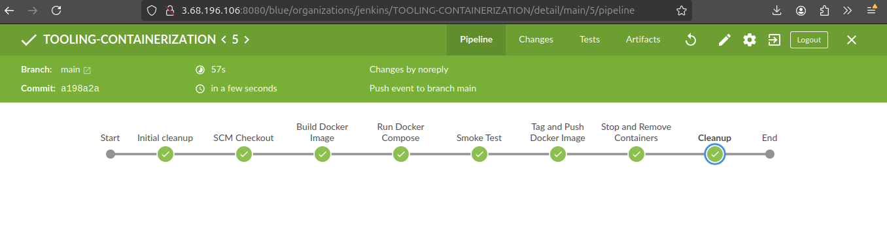

#### 4. Implement a similar pipeline for the PHP-todo app.

See repository [here](https://github.com/citadelict/php-todo-containerization)


### 5. Ensure that both pipelines have a clean-up stage where all the images are deleted on the Jenkins server.


Confirm the tooling site image in the registry

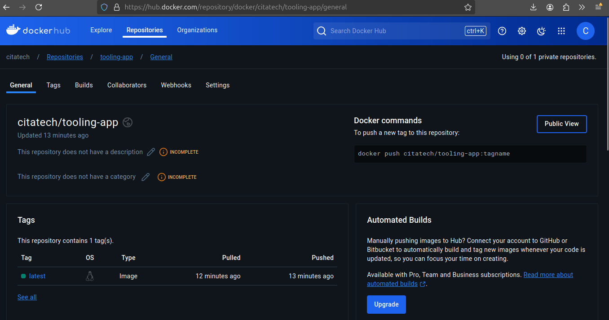

### Conclusion

We have migrated our application running on virtual machines into the Cloud with containerization.

In the next project, we will expand our skills further into more advanced use cases and technologies.
